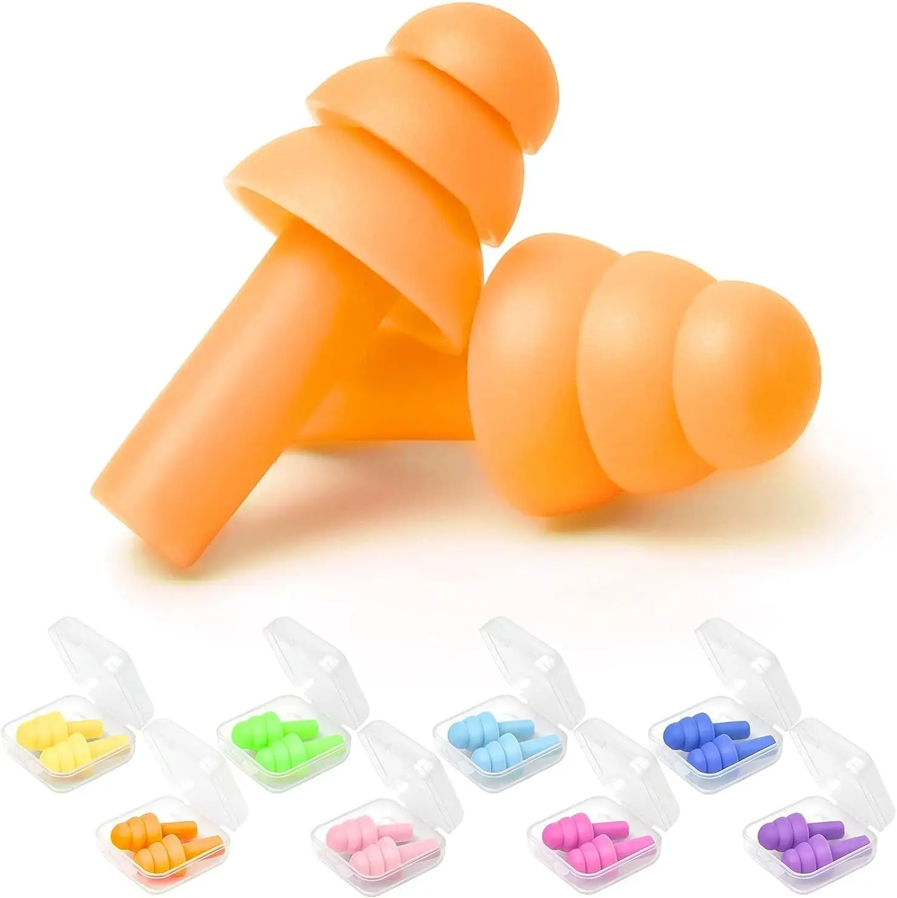
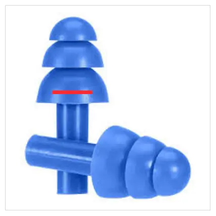
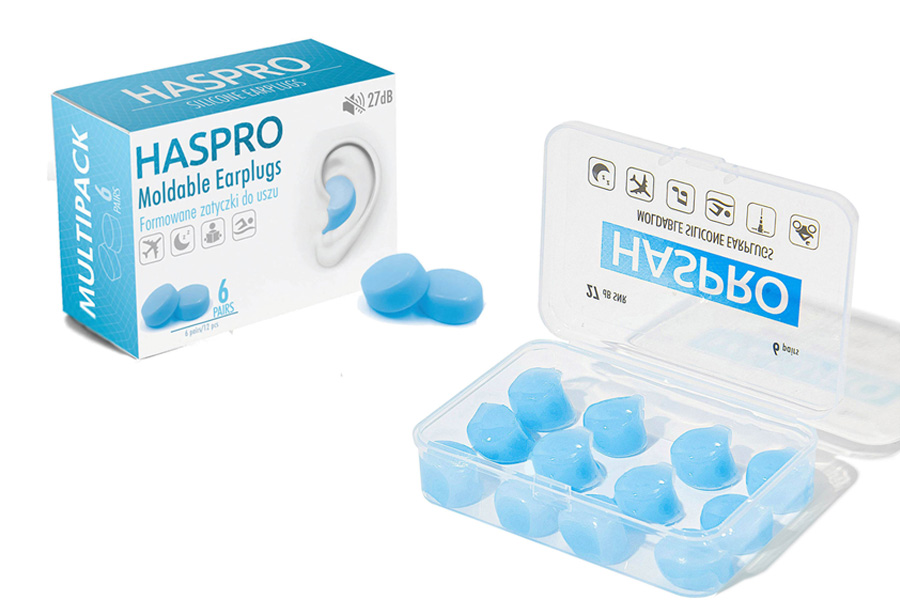

+++
title = 'earplugs'
date = '2025-07-13'
draft = true
+++

I'm autistic, and sound bothers me a lot. I often fantasize about going deaf.

To this extent, I live most of my life in earplugs. \
Today I'm going to share with you my experience with different types of earplugs, and which ones I recommend you get!

# prerequisites

I am very poor, so I can't afford the more fancy earplugs; \
Thankfully even while being cheap, you can get yourself a pretty stellar experience.

Let's start with the earplug type that showcases this the most!

# silicone tree shaped

Silicone tree-shaped earplugs, that I will now be referring to as “trees”, end up being basically entirely free, over time. \
While every other earplug type you need to eventually replace, this isn't the case with trees! \
Buying a single pair will cost you maybe a dollar, and you can reuse that pair basically indefinitely. \
I don't remember when exactly I bought my first pair, but it's certainly more than a year ago now 🤔 and they're still completely okay.

Of course, you shouldn't reuse them straight up: you should wash them after every use. \
That's where buying multiple pairs comes into play! I can wash more of them at a time, which ends up being far less laborious. \
I have 4 pairs, so 8 earplugs (of this type) in total, and that seems like a good balance of effort to me.

This is completely a guess on my part, but you probably shouldn't leave your earplugs “dirty” for more than a day. Which is why just buying a billion pairs isn't a great idea.

Especially if you plan to spend most of your life in earplugs, like I do, something that you need to future proof is ear infections.

## ear infections

The worst thing about an ear infection is that it becomes uncomfortable or even impossible to wear earplugs! \
Yes this is the worst thing and it's not even close.

Over time I found a pretty simple trick to make sure nothing weird forms inside or outside of my ears.

Wash em.

Every day, in the morning, I wash the outside of my ears with soap. \
Be elaborate about it, don't miss the various crooks and crannies — you'll thank yourself later.

But only use soap for the *outside* of your ear — *not* the ear canal itself. That at the very least *feels* like a bad idea. \
For the ear canal, I simply take my wet finger{{fn(i=1)}} and blammo it in there, rotating it very gently and slightly. You probably know the drill. \
After doing this, ideally while the ear canal is still wet, I use q-tips.

Q-tips that are stuck on *plastic* “sticks” I find to be unsafe/unstable — there have been more times than I'd like where the cotton part almost fell off inside of my ear. \
Because of this, you should buy q-tips on *wooden* “sticks”. Those, I find, keep the cotton attached *way* better.

Go figure! \
Try to glue a piece of cotton to a piece of round plastic, vs a piece of rounded wood — you'll see quite quickly why the latter is more trustworthy.

Now, I know that doctors have been saying to not use q-tips for your ears. Allegedly doing so is bad. \
But it's been working for me so I don't intend to stop :p

# back to trees

Cleaning the earplugs is important with all types of them, of course, but trees are the laxest of them all. \
Because of the nature of the material — silicone — the surface of the earplug is very smooth, so weird stuff is the least likely to grow on them. \
This tracks, as silicone *body scrubbers* are similarly more bacteria-resilient then *their* alternatives. So all in all, this is a pretty nice benefit.

> I hope you already knew, but just to point out: I am not at all a doctor, **all** of my advice is based on uneducated (chatgpt and common sense) guesses, as well as experience.

Now onto the actual *process*/technique of washing the earplugs. \
I prefer to use hard soap, as unlike with liquid soap, the earplugs don't feel slightly soapy after washing them. May just be a preference thing though. \
I take all of the dirty earplugs in my left hand, and put that hand under running water, to wetten it. Try not to drop any ;) \
Then I wetten my right hand, and caress the hard soap, to soap up (is that a thing) my right hand. \
Now, I rub my hands against each other, soaping up the earplugs in between them in the process.

See how it becomes more efficient to have more dirty earplugs at a time? \
I don't wash each one individually; in my experience there has never been a need to do that, as this “washing my hands but with earplugs in between” strat has been working really well for me.

Once they're all soapy, I bring back my hands under the running water, continuing to rub until I no longer feel any soap on the earplugs. \
That's it!

I've considered using isopropyl alcohol to clean earplugs — it sounded like a reasonable idea. \
But apparently that is a very **bad** idea! So, no need for anything fancier than soap.

Now, about drying. \
You shouldn't just blammo the washed earplugs in a pile, instead give them space in between, to dry the most efficiently. \
I like to place them sequentially, so that it's very clear to me which earplugs are the “dryest”, when I pick up another pair to use. \
When you use *these*, or *any* other earplugs, they *should*{{fn(i=2)}} be dry.

You should always leave earplugs to air-dry (naturally, basically), never use anything to wipe them with. \
Because any itty bitty piece of paper, cloth, or whatever else will be *going in your ear* — too big of a risk.

To make sure you always have a dry pair for you to use, buying multiple pairs helps a lot. \
But something I realized when trying out various earplugs, is that buying many pairs at once is a bad idea. \
Buy one / a few at start, try them out for a while, and then expand your collection once you're sure you like these.

The biggest deciding factor for how long you'll be able to wear an earplug, is how much pressure it applies to your ear / ear canal. \
Even the smallest of weight ends up compiling to make a difference once you wear it for hours on end. \
With that in mind, the “trunks” of trees are quite a lot of weight! \
They're there to let you pull out the earplugs easily, but their length is nonsensical.

Something that Big Ear doesn't want you to know is that you aren't supposed to keep the trunks!

Just kidding, this is actually something Big Ear expects you to know: the trunks are so long as a safety measure, probably to not get sued if anything, but you are supposed to cut them to the length that is most comfortable, while still making it easy to pull out.

I cut my trunks quite extremely: above the flaps, but not right at the base. \
As an analogy, if the flap is a short skirt, then you should cut at where your ass starts. You're welcome ;)

I no longer pull out the plug by the trunk, but by the ~~flap~~ skirt. \
The material is plenty strong, so you aren't destroying the earplug by trying to tug on its skirt. \
Just, being slightly disrespectful is all.

Now that you know the main strat of making trees more viable to actually use, here's the insertion method. \
It's very simple! Unlike the other earplug types we're going to talk about.

## pushing in

With an 👌 grip, hold by the skirt, putting your thumb against the trunk (that you now have cut down to oblivion). \
Once you get the earplug close to your ear, press it against the ear canal, using your thumb to push it into your ear. \
Rotate slightly as you do this, until the final flaps are the only ones slightly sticking out.

If you feel like a vacuum formed, tugging on the insides of your ear, this isn't intended! \
Nothing particularly bad, don't worry, just kinda off — it doesn't help to remain in earplugs that are making you anxious.

To fight against the vacuum issue you'll sometimes run into, let's learn how to pull *out* trees.

## pulling out

For the same reason why the vacuum effect is bad, pulling out trees too forcefully is also bad.

The main idea is to be pulling out the earplugs slower than you pushed them in. \
Hold by the flap, and *gently* + slightly move around the earplug, *lightly* pulling on it. \
Before long, you'll have pulled it out!

A technique I discovered pretty recently while learning another earplug type we're going to talk about, can make this process even easier. \
Actually, it helps for every type of earplug I've tried! \
For the example, we're going to be pulling out the earplug in your right ear.

Take your left hand, and put it behind your head. \
Now grab the top of your ear, and pull back towards where your hand came from. A lil bit upwards, too.

You have now straightened the ear canal to some extent, making it way easier to pull out the earplug! 🥳 \
I sometimes find this technique useful to push *in* the earplug, too; however for inputting trees, I don't feel like this technique is necessary.

## sleep

The biggest usecase people usually have for earplugs is sleep. \
So I'll be elaborating on how well each earplug type works for sleeping in!

If you sleep on your back, I envy you. You can easily sleep in trees with no issues whatsoever, however another earplug type might be even better for you. \
I exclusively sleep on my sides, though.

If you skipped cutting off most of the trunks, trees will be impossible to sleep with, so I'm assuming you *did* cut them. \
Trees aren't made to perfectly align with the shape of your ear, and kind of work on a best effort basis. \
This “best effort” is great anyway, but the material *will* be applying pressure onto your ear canal. \
When it's in your ears for 8+ hours while sleeping, this ends up resulting in ringing in your ears, when you wake up.

This is not that particularly bad: especially if you only use earplugs for sleeping, this is a non-issue. \
But if you intend to continue on your day using earplugs, all this ear pressure may sum up to be quite jarring!

I found a weird technique that helps alleviate this. \
It's gimmicky as hell, but far more viable than it sounds.

The biggest pressure that's applied while sleeping, is on the ear that's resting on the pillow. \
You put pressure against the earplug, and in turn against your ear canal,
moving it around in unnatural ways as you move in your sleep. \
To an extent, you can think of it as putting the weight of your head on your ear canal.{{fn(i=3)}}

When your ear is directly on the pillow, most sound is already muted, so the earplug isn't doing much there aside from creating this pressure issue. \
So what I do, is put the earplug only into the ear that will *not* be on the pillow!

I rotate in my sleep a lot though, I can't just keep the earplug in only one ear. \
When I want to rotate, I pull out the earplug from one ear and put it in the other, and continue sleeping. \
To rotate in my sleep, I wake up slightly, and that seems to be enough to do such a seemingly complex action. \
This way, I alternate the ear canal pressure throughout the night, effectively letting each ear rest. \
And the pressure that *is* applied, is only on the “free” side, rather than the pillow side, so the sum of the pressure is reduced too. \
Maybe this technique will work for you too!

{{hn(i=3)}} This is probably not an issue on a soft pillow, though. Mine is hard.

{{hr(id="friend")}}

Silicone tree shaped earplugs are going to be your best friend. \
Reliable, cheap, easy to install (lmao), surprisingly comfortable. \
If you don't intend to spend *as* much time as I do in earplugs, these might just be all you need.

# loop

[Loop](https://www.loopearplugs.com/) is a specific brand of silicone tree (?) based (?) earplugs, that I keep hearing about. \
As mentioned in the beginning of this blog, I'm broke so I cannot afford these, but am very curious about them!

Every time I come across a loop user in the wild, I ask them what they think about them. \
So far, *everyone* has replied with “oh yeah they're great, I love them”. \
No one has expressed “overpriced for what they do, considering you can buy something similar for a buck”, which is a take I expected to hear quite a bit!

So, if you have the money to spend, they seem like a pretty great pick. Complete hearsay, though. \
If you do use these, or buy these after reading this blog, please share what you think about them! \
You can find my contacts on the main page of this blog; Most direct is to dm me on discord @axlefublr

# silicone moldable

I used trees for a long time before trying these out, and the thing that inspired me to do so is *canal pressure*.

When you use earplugs genuinely *most* of the day, the best effort basis of trees isn't perfect — your ears feel the wear & tear after a while 😔

Silicone moldable earplugs solve this issue in a funky way. \
While most earplugs are meant to be inserted *into* your ear canal, these *aren't*!

The idea with these is that they're *malleable*, yet sturdy. \
Kinda similar to modeling clay!

Intead of pushing them inside of your ear, you *cover* the ear canal. \
Thanks to the plasticity of the material, it can go *exactly* along your ear shape, and it's how it can be really effective at blocking sound!

You'd think you'd get a sound blocking *downgrade* by *not* filling your ear canal, but actually I can't tell a difference in sound, compared to trees! \
But most importantly, you are no longer abusing your quite sensitive holes, and that lets you keep them filled for a lot longer, without any downside.

## pushing in

When I first got these, I didn't quite get the memo about how I'm meant to use these... \
Nothing bad happened from me inserting them into my ear, but it's technically incorrect!

“Why *not* insert them, if that's chill?”, you might ask. \
Unlike trees, that use an inherently hard-ish material, moldables are more on the viscous side. \
Not sure what to compare them to actually, maybe like 10x harder honey?

Anyway, due to the more liquidy nature of these, you're running some risk by putting them *inside* of your ear. \
The hotter the material becomes, the more squishy it is. \
While on the *outside* of your ear, that's not a problem whatsoever: it's not that hot there, and even if it becomes extra sticky, you can still easily pull it away. \
But the *inside* of your ear is a different question! \
If, god forbid, you pull on it not carefully enough, trying to pull it out of your ear canal, \
and a piece of it stuck really tightly to an ear wall, \
you now have a piece of bullshit in your ear!

You definitely don't want to run that risk, especially considering that there's actually *no upside* to doing so. \
Let me teach you the *correct* way to use them!

First, squish the “tablet” for a bit, forming it into a ball that's a bit warm from your hands. \
Note, a *ball*, not an elongated shape how you might expect! \
Place it on your thumb.

Remember the whole dance we did with straightening the ear canal, back in the trees section? \
We don't need the canal to be straight in this instance, we are supportive parents; \
But still I find that “unwrapping” the ear is quite helpful in putting the tablet into place.

For putting the tablet on your right ear, “unwrap” the ear with your left hand. \
Now get the tablet on your right thumb close to your ear canal, and start pushing it on top of it, with a sliiiiight twist{{fn(i=4)}}. \
Our goal here, mainly, is to *cover* the ear canal. Remember, we don't need to push it *inside*.

Moldables are sticky by design, and are especially so when new. \
So after you push it *on*, just pulling away your thumb is a fool's errand — you'll pull away the tablet with it, a bit, and loosen the connection, which you want to avoid!

To handle that, I have a process. \
We don't need the left hand to be holding the unwrapped ear anymore, so use a finger from that hand to lightly hold the earplug in place — you can now pull away the right hand thumb without pulling the earplug away with it. \
We're not *fully* done yet; moldable earplugs work by *plugging* your ear, so that sound doesn't come through. \
So now your job is to push it around, to make it hug the ear and have a quite strong connection that way.

How exactly to *spread* it is a bit of a skill in its own right, and I don't think I can fully explain it away. But the main idea is that you should stay within the area of where the ear canal starts; no need to go far — you'll block no sound covering an area that isn't near the ear canal.

## lastness

Trees last you infinitely, but moldables don't! You will need to replace them every so often. \
I've been measuring how long they've been lasting me; I like to use 4 pairs (8 in total) at a time, and to replace them based on a fairly consistent feeling — once I catch myself thinking “goddamn these are so inconvenient, I'd rather just use trees”, *that's* when I replace them. \
In-shape moldables *are* convenient, which I find out again and again after a replacement: “ohhhh that's how good they are at start”.

22 27 31 — these are the three recorded times, in days, that 4 pairs have lasted me. \
As you can see, the number keeps increasing :o (for now) \
I think that's in part due to some techniques I'm using, that I'm going to share with you. \
But the bottom line is — 20 days is conservative, 30 days is pushing it, 40 days is a dream and forget about it, genuinely. \
Although if you're not deafmaxxing like me, they may last you longer due to you using them less? \
But considering that *dust buildup* is probably the highest concern, it's probably not by much.

## washing

❗trees can manage being dirty kinda (if you be lazy), these just lose effectiveness so really need to be washed
❗trees just get washed by incident, moldables need individual care; gently brush them with your fingers to wash off the soap that you are using (have you mentioned your preference for hard soap? mention that it matters a lot more here) — soapiness will reduce stickiness which you wanna retain

## back to lastness

❗sequential container for drying off and protecting from dust

❗it might be a good idea to pull apart some bit, but don't rush with that as you may waste some of them in the process, as putting it back together doesn't particularly work “deeply unpleasant, despite being technically usable”

# footnotes

{{hn(i=1)}} Disgusting, I know. Bear with me. Aaaargh!! 🏃‍♀️🧸

{{hn(i=2)}} Like in [rfc 2119](https://datatracker.ietf.org/doc/html/rfc2119) (lmao)

{{hn(i=4)}} In season 2 we learn that it was the villain all along /j
