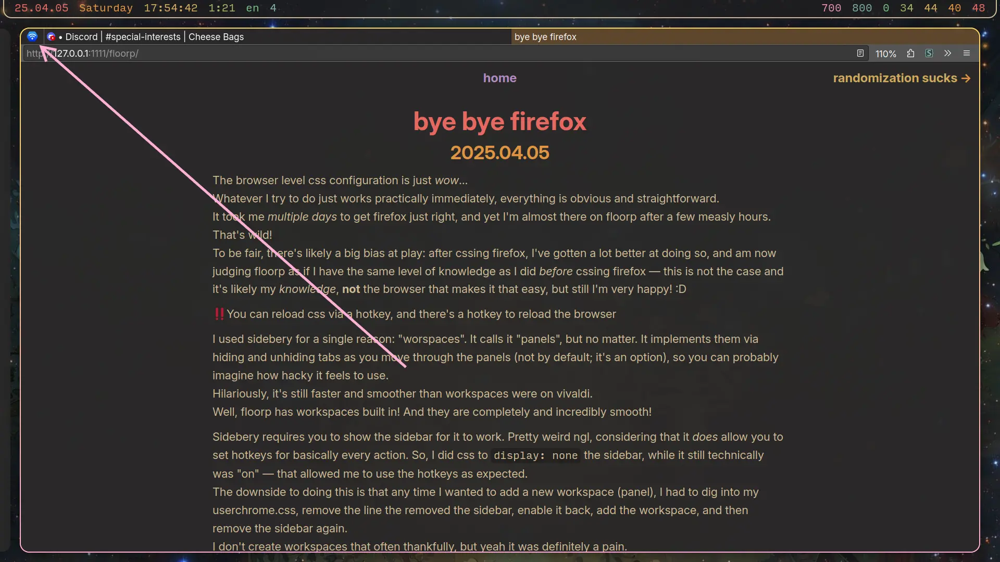
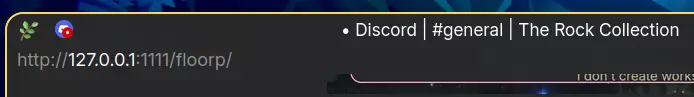
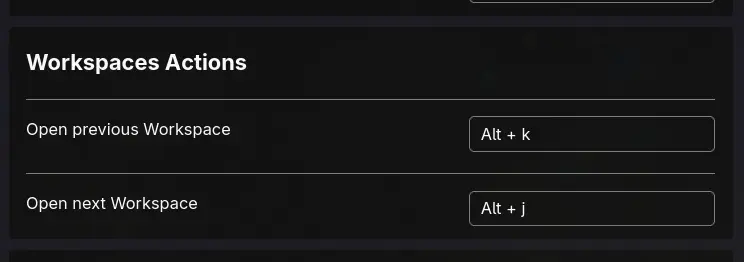
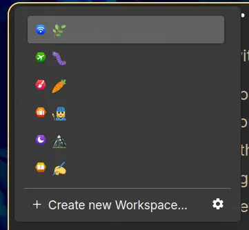

+++
title = 'bye bye firefox'
date = '2025-04-08'
+++

You might reasonably expect me to have switched off from firefox due to the recent privacy concerns drama. \
~~But it was me, Dio!~~ But I actually could not care less about my privacy. Matter of fact, I think it's strange and silly to expect your browser to be private about your data. The web is so huge that I can't get how this can ever be an expectation or even a hope.

The actual reasons are somewhat muddy, and because of that I couldn't collect enough energy to actually start the switching process: my firefox switch took an ABHORRENT amount of energy, and repeating that again felt quite scary.

1. My partner really loves this browser, and wants me to try it out a lot
2. It allows you to change hotkeys
3. It has built in workspaces
4. Browser level css is "better" (I didn't quite know in which way yet, but trusted it)
5. Because of being able to change hotkeys inside, I offload the need for xremap, as I intend to switch to kanata soon

# css

The browser level css configuration turned out way better than advertised. Truly stunning! \
Whatever I try to do just works practically immediately, everything is obvious and straightforward. \
It took me *multiple days* to get firefox just right, and yet I'm almost there on floorp after a few measly hours. That's wild! \
To be fair, there's likely a big bias at play: after cssing firefox, I've gotten a lot better at doing so, and am now judging floorp as if I have the same level of knowledge as I did *before* cssing firefox — this is not the case and it's likely my *knowledge*, **not** the browser that makes it that easy, but still I'm very happy! :D

To get started cssing the browser, the process is quite a bit more discoverable. \
Right click on the workspaces button to enable the menu bar. In it, press CSS -> CSS -> Create Browser CSS file.

In the prompt shown to you, you will create a css file that you'll be editing to customize the browser ui. \
You can then find the file to edit it as you wish, by clicking "Open CSS Folder" in the same menu. \
Unlike the usual firefox userchrome configuration though, you *don't* have to restart the browser for the changes to take effect! \
Just press <kbd>alt+r</kbd> to reload your css file into floorp whenever you make a change in it.

Not having to restart the entire browser to check every change is an *incredible* help for productivity. Although for other things that I might wanna restart my browser for, there's another built in hotkey to do so: <kbd>ctrl+alt+r</kbd>.

Here is [my css file](https://github.com/Axlefublr/dotfiles/blob/main/floorp/CSS/floorp.css). I thought I might as well share it since I'm talking about it, but I give no guarantees that it will be helpful, well written, documented, or even work for you.

# workspaces

I used sidebery for a single reason: "worspaces". It calls it "panels", but no matter. It implements them via hiding and unhiding tabs as you move through the panels (not by default; it's an option), so you can probably imagine how hacky it feels to use. \
Hilariously, it's still faster and smoother than workspaces were on vivaldi. \
Well, floorp has workspaces built in! And they are completely and incredibly smooth!

Sidebery requires you to show the sidebar for it to work. Pretty weird ngl, considering that it *does* allow you to set hotkeys for basically every action. So, I did css to `display: none` the sidebar, while it still technically was "on" — that allowed me to use the hotkeys as expected. \
The downside to doing this is that any time I wanted to add a new workspace (panel), I had to dig into my userchrome.css by finding it in firefox browser devtools, remove the line the removed the sidebar to enable it back, add the workspace, and then remove the sidebar again. \
I don't create workspaces that often thankfully, but yeah it was definitely a pain.

In floorp, you simply get a small thingy to the left of your tabs, that shows the icon of the current workspace (as well as its name, optionally)



It's tiny by default, so I made it a bit bigger with css. \
Unfortunately in terms of icons, you have to pick among the predefined ones: you can't blammo an emoji or svg, how I'd love to be able to do. But good enough! \
A hack you can probably use, and one that I might try out, is to *name* the workspaces using emojis, and *remove* the icon with css. That way you'll only see the name of the workspace, which just so happens to be an emoji of your choosing.

{{ hr(id="i-tried-it") }}

Couple of days after writing the above sentence, I *did* try out the idea. \
Turns out it's awesome! :D



Now I simply name the workspaces with emojis, and get to have a nicer looking indicator than the default selection of icons I'd have to otherwise use.

Here's the css to remove the icon:

```css
#workspaces-toolbar-button>.toolbarbutton-icon {
  display: none !important;
}
```

# hotkeys

You can configure your hotkeys! Quite a few of them, at least. Now I get to have <kbd>alt+h</kbd> / <kbd>alt+l</kbd> go the previous / next tab, without having to do an xremap hack to achieve that. Your remapping choices aren't even close to the power of something like vivaldi, though. Still, much better than not being able to to begin with, like in base firefox.

For example, while you can set hotkeys to go to the previous / next workspace, that's all you get. Yes, somehow there aren't built in actions to move the current tab to the previous / next workspace, or really *any* other workspace related action you can bind to, which is very strange. \
I guess I'll give some leeway with the excuse that the project is somewhat new and undercooked. But still, I never get how features this obvious are missed.



Even these two actions are kinda buggy. When you go to the previous or next workspace, you toggle the workspaces panel (↓).



So say you start on the 🌿 workspace and go to the next workspace (🐛). The workspaces panel is now opened. \
You continue going next to 🥕 — the panel is now closed. Then onto 👩‍🏭... and it's opened once again???

So as you move through your workspaces, the panel plays peekaboo with you. I'd be fine with it either showing always as you move, *or* never showing, but somehow it does the worst possible behavior. \
So far I don't have a *good* solution to this, but I solved it well enough: I `display: none` the workspaces panel as a whole, and enable it whenever I need to add, rename, or move a workspace.

> But wait Terri, didn't you complain about having to do this with sidebery?! :o

Yes! But there are reasons why doing practically the same thing in floorp is *less* of a pain:
1. I can reload my css via a hotkey
2. Doing so does not restart the whole browser
3. I simply edit the css file in helix to then reload, rather than having to change it in browser devtools to avoid a restart (how I needed to in firefox)

Here's the css I use to remove the workspaces panel:

```css
#workspacesToolbarButtonPanel {
  display: none !important;
}
```

{{ hr(id="moving") }}

Of course, if I really couldn't move tabs across workspaces with my keyboard, I wouldn't've switched to floorp. No way. \
But a certain feature comes to save me: "Custom actions".

This is probably the coolest part of floorp, for an experienced user. You can set hotkeys to execute your arbitrary javascript! :o

Go to `about:config` and search for `floorp.custom.shortcutkeysAndActions.customAction1`. You set that setting to the javascript you want that action to execute. Then in `about:preferences` -> Keyboard Shortcuts -> Custom Actions, you can set hotkeys to execute those custom actions. \
Interestingly you only get five of them. A bit of an arbitrary restriction, but I'd usually expect that arbitrary number to be 10, not 5. I already use 3 of them — a bit quick to run out of. \
This is also why I don't solve the peekaboo problem with custom actions, even though I technically could.

My partner wrote this custom action for me, that moves the current tab to the next workspace:

```js
(async () => {
    const currentTab = window.gBrowser.selectedTab;
    const workspaces = await gWorkspaces.getAllWorkspacesId();
    const current = await gWorkspaces.getCurrentWorkspaceId();
    const currentIndex = workspaces.indexOf(current);
    let destinationIndex = currentIndex + 1;
    if (destinationIndex >= workspaces.length) {
        destinationIndex = 0;
    }
    const destination = workspaces.at(destinationIndex);
    await gWorkspaces.changeWorkspace(destination, null, false, true);
})();
```

How to make this move the tab to the *previous* workspace is an exercise for the reader. I believe in you.

Another issue I found, that is solved by a custom action: pressing <kbd>Escape</kbd> while in address bar doesn't focus the page. \
I'm a vimium c user, so I really don't want to use my mouse to focus the page back after focusing the address bar. Being able to do so with the keyboard is a corely important workflow bit for me! \
I blammoed `document.querySelector("browser[primary='true']").focus()` as a custom action and bound it to a hotkey. \
I'd rather <kbd>Escape</kbd> work by itself, but this is good enough I think.

# proxy

Let's get to the *third* thing that would make me give up on the switch, if it wasn't for my partner.

Proxying works strangely in firefox for me. The FoxyProxy extension that you may know straight up doesn't work for me there. \
However, if I configure my proxy in settings of firefox, it *does*.

In floorp, FoxyProxy started working for me 🥳 \
*Except* for playing videos on youtube... I used the same exact proxy, and it *does* continue to work like normal in base firefox, so this was very strange! \
At first I assumed that it was me changing some setting that fucked things up, but after trying out a blank floorp profile for a test, my proxy didn't work there either.

So, my conclusion is that the internals of proxying work differently in floorp, for one reason or another. \
In a panic, I start considering my options of solving this. I was too deep at this point to want to go back to firefox (workspaces are too good), and opening firefox just for watching youtube felt assy too. \
Alternative youtube frontend? Trying to make yt-dlp work again? Quitting youtube? /j \
I was saved once again! I now have an extra proxy that *does* work for loading youtube videos in floorp (not sure why), so I can continue to use this browser in peace 😌

{{ hr(id="she-cooked") }}

Overall, the feeling I get from floorp is that it's a bit undercooked, but gives you the power to cook it to your preference. That is exactly how I approach most software, for better or worse, so that's a green flag for me :3
