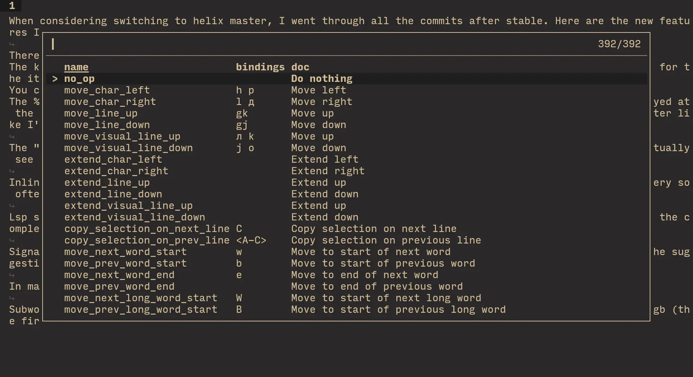
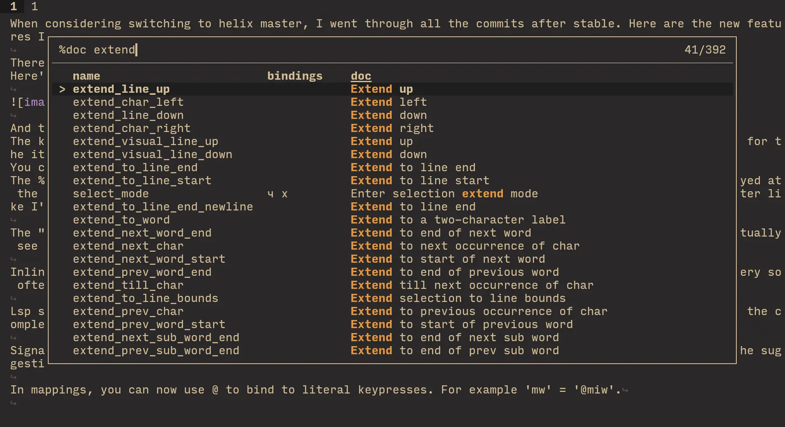
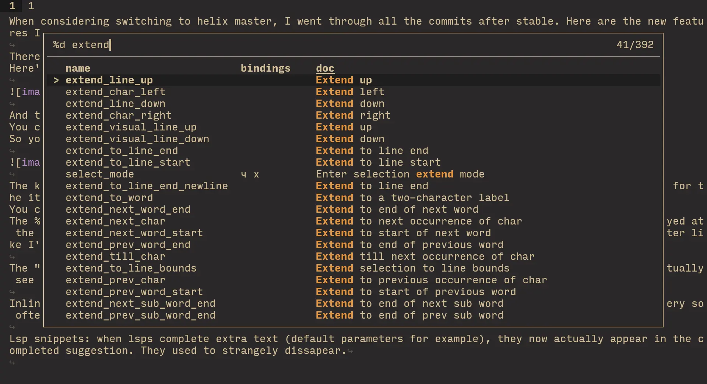
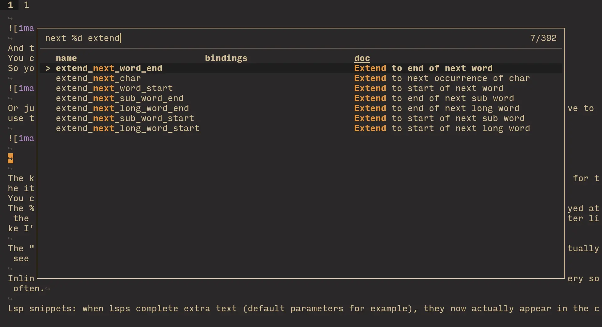
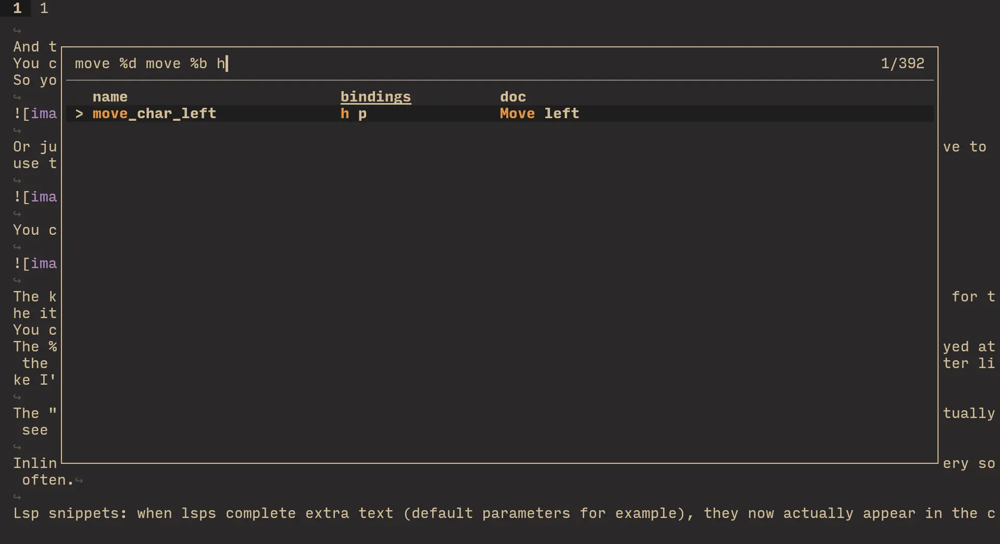
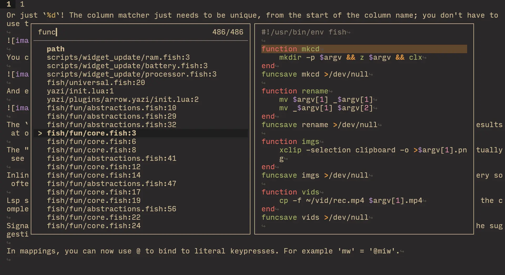
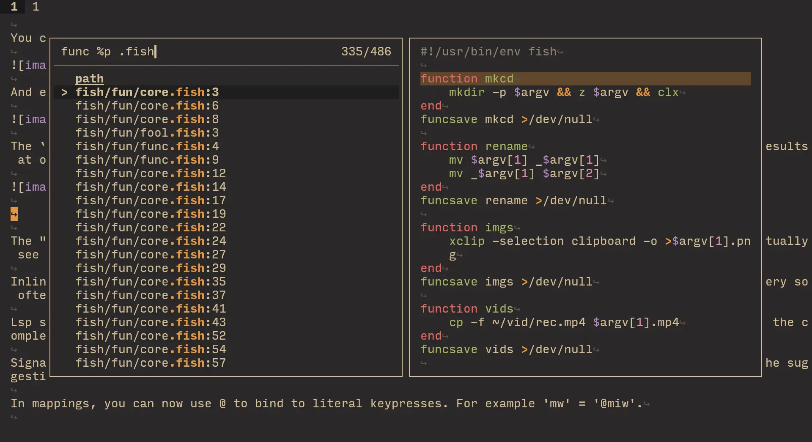
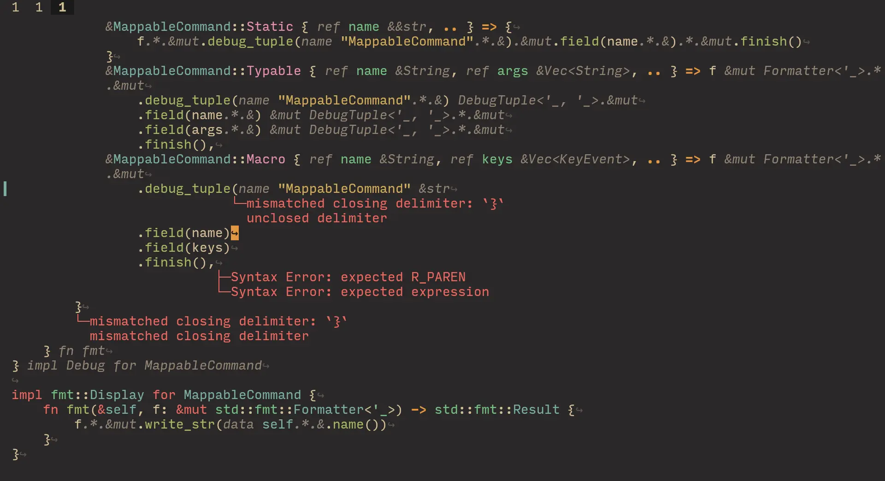

When considering switching to helix master, I went through all the commits after stable. \
Here are the new features I discovered.

## pickers

There's a picker refactor: most pickers now have columns, that you can search directly. \
Here's how the bindings picker looks like now:

And thanks to columns, it's much nicer to use! \
You can type in `%column_name` to start searching in that column. \
So you can search by *specifically* documentation by using `%doc`:

Or just `%d`! The column matcher just needs to be unique, from the start of the column name; you don't have to use the full name.

You can combine a normal search with a column search:

And even multiple:

The `global_search` action used to prompt you for the search in the commandline area, and then show the results at once. Now it is an interactive picker, and shows results as you type in the regex pattern:

Also has a column you can additionally filter by:

There's now an [`inline-diagnostics`](https://docs.helix-editor.com/master/editor.html#editorinline-diagnostics-section) option in the `[editor]` section, that lets you have [lsp-lines](https://github.com/ErichDonGubler/lsp_lines.nvim)-like diagnostics (without being super buggy, like that nvim plugin is).

Lsp snippets: when lsps complete extra text (default parameters for example), it now actually appears in the completed suggestion. It used to strangely dissapear. \
This snippet implementation is not full; you still can't go to the previous / next node in the snippet, for example.

Extra information for suggestions now appears at the top / bottom of the screen, rather than being squished to the side of the suggestion box. So generally you get to look at it a bit more normally.

In mappings, you can now use @ to bind to literal keypresses. For example `'mw' = '@miw'`.

Subword movement actions. Search for them with `sub_word` in the keybind picker. I went with using `gw`, `ge`, `gb` (the first two are mapped by default, I moved those default mappings elsewhere).

Hardlinks were broken: if you wrote to a hardlink, it wouldn't update the other file. This was fixed in master.
