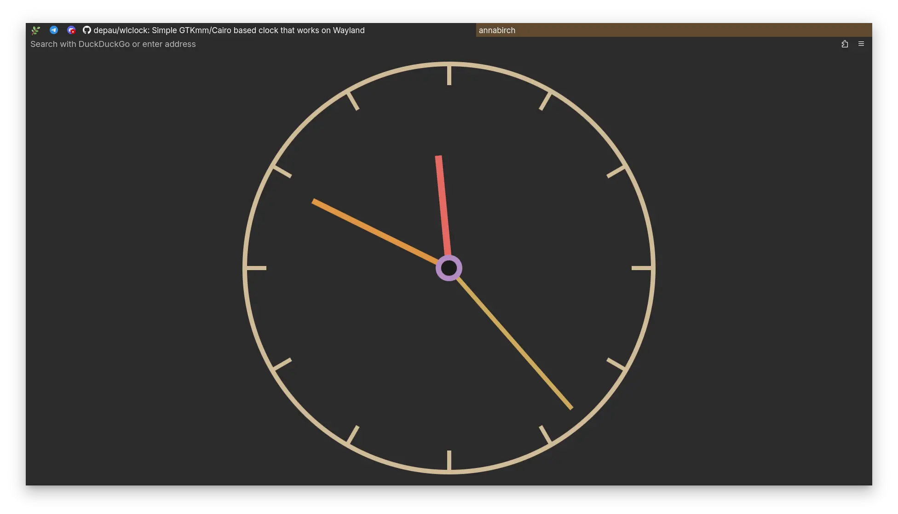

+++
title = 'i overuse anki'
date = '2025-08-31'
+++

No, I have not burned out on anki. \
All the advice I share in my [how to anki](@/how-to-anki.md) blog post still works… \
A little too well, actually??

A very common issue anki users face is that your workload creeps up on you over time, constantly increasing and eventually burning you out. \
My system, however, is designed specifically to not allow that! \
What is “it only seems free!!” for others, *is* quite free for me.

What this resulted in, is that I don't take notes **at all**. \
I either make an anki card, or discard the information. \
This has been working really well as I've already expressed, but has a more *hidden* caveat I noticed only recently.

{{hr(id="quickshell")}}

I want to make myself an analog clock :3 \
Maybe a window, maybe an overlay widget; \
Some sort of easily and quickly openable gadget that would allow me to *feel* the time.

Istg I've never been to the military, but I can only *feel* time on an analog clock; \
Digital ones *tell* me the time, but they don't *show* me it, yk?

In my fairly short adventure of trying to find an analog clock thingymabop, I haven't found anything that I actually feel like *using*.

TUI clocks are god awfully ugly and therefore impractical — too cell dependent to be graphically accurate and neat-looking.

The browser is often a common platform to build guis in, and quite importantly *easy* to build guis in. \
I found [a project](https://github.com/abhishekgurjar-in/Analog-Clock) that is a basic analog clock website, then [forked it](https://github.com/Axlefublr/annabirch) to make my changes. \
I quite like it!



However the issue is that it *is* in my browser. \
Something I'd like to be able to do is look at the time, ad-hoc, while doing anything else at the time. \
If, say, I'm watching a youtube video in fullscreen, and then open the clock in a new tab, well now I've unfullscreened my video and it's a bit unpleasant :/ \
If I force open it in a new browser window, it's now **slow** to open!
And that's no good...

So I need some sort of “just a window” clock app / program, that opens **fast** and is still styled how I like it to be. \
I found [this project](https://github.com/Depau/wlclock) which might actually fulfill my needs, but I need to edit C++ code to customize it. \
Some very basic things are defined as uhhhhhh C header variables? (idk, don't ask me), but to make it be how I want it, I need to edit the normal source too. \
Somehow, in all my trying, I could **not** for the life of me figure out how to make the background of the app fully transparent. \
Funny thing is, the *sides* are already transparent, suggesting that it *is* something the program is able to do, but there's a square background defined god knows where, configured by god knows what!
And I cannot change it 😭 At least, I don't know how...

I was meaning to get back into trying to figure this out, after initially failing, but now I'm feeling like it's a bit of a fool's errand. \
How about I employ a fun learning trick I like to use?

Instead of focusing *only* and **exactly** on my specific usecase, I'll use that problem as a motivator to go learn something larger.

I want to make hotkeys that use `niri --json` to do various windowing actions — cool, I'll learn nushell as it lets me operate on json conveniently, *among many other things*. \
Would be cool if [floorp](@/floorp/index.md)'s wrapped tabs were all of equal size, rather than the last row expanding the tabs on it — epic, I'll learn css grid and only *after* realize that the idea was not feasible{{fn(i=1)}} \
I want an analog clock — nice, I'll learn *quickshell*.

How exciting!
New learning project :D \
I start reading quickshell's docs, and open the docs of QtQuick… Only to find myself in **terror**. \
There is **so much**!{{fn(i=2)}}

So many pages, so many thingies, *so much to learn*. \
And all of this somooch (💋) will end up as anki cards, maintained in my memory forever, only for me possibly to never use like, 90% of it. \
There's a good chance I'll actually never get to making the clock, and leave after making a volume change osd. \
Yet, despite not being used information, I'll remember it until the end of time...

THAT is when I finally noticed, that the *volume* of how I use anki, actually *restricts* me.

Because of how strongly I rely on anki, it is the only source of information I'll often use. \
If I have something ankied, I will sometimes wait for the next review of some piece of knowledge, rather than just look it up again — doing so feels like a waste. \
A waste, because I'm effectively messing up the anki algorithm by doing another review that anki doesn't know about. \
Yes, having anki work correctly is apparently more important to my brain than the information I'm trying to remember in the first place 😮‍💨

Biggest example of this happening is alphabet indexes: I have them all as anki cards, and I expect *anki* to ensure I remember them all. \
This works quite well of course, but I have some letters the indexes of I'm not *sure* about. \
*Pretty* sure p is 16, u is 21, q is 17 and s is 19, but I wouldn't bet my life on it, you know? \
When [manually sorting](@/consider-sorting/index.md) something, I'll sometimes be in this strange state of unsureness, yet refuse to *simply* check. \
It wouldn't even take much time to do, either! But I'm stubborn on letting anki do its job.

This phenomenon happens even with information that is still “new”, rather than thoroughly reviewed in anki. \
I rely on anki to solve what it hasn't even gotten to yet!

Say I learn a new programming language.
I make anki cards for everything that I learn while reading its book, and eventually finish reading it, “completing” my language learning. \
However, that's *not* exactly how it is in my head. \
Intead of the more natural flow of learn a bit + practice / use a bit, because of **anki** I've built up this strange expectation of “learn everything first, then use everything after”.

My most recent big learning adventure was nushell, and it's exactly how it went — I was for the most part dead set on not using nushell until I've “finished” learning it, whatever the fuck that means. \
I believe this is due to anki once again (although autism plays a part too) — if I haven't gotten through some card, I don't *know* that information. \
Which is an awfully restrictive way to learn!

Now, if I simply went through the new cards quickly, this wouldn't be much of a concern. \
But then I'd have a different issue! The massive workload 😔

So what I do instead, is have a queue of new cards that are went through slowly but surely. \
Quite often, to get to the new cards of the topic I'm *currently* learning, I'd effectively need to wait like 20 days, sometimes more. \
Learn something. Wait 20 days. Use it. \
I'm exagerating quite a bit, but putting it into words helps highlight just how silly my learning approach is.

Due to the queueic nature of my learning, any small and big new learning adventures feel bigger than they need to be: “it's gonna be a while until I fully finish this” is what I subconciously think. \
God forbid I simply learn what I need in quickshell, and continue on with my life! \
Noooooo, I need to have all the niche details specifically memorized for some reason. Stupid.

Learning feels big, because it's a bad idea to try to memorize information out of context. \
Intead of memorizing some big specific way of doing a task, understand and remember the parts that make it work — that'll make it a lot easier to reproduce on a whim. \
To make this work, I feel required to “consume” the entire documentation of some software to be able to use it all, often times. \
And then I carry the chain and balls of the eventual effort it takes to memorize that entire documentation.

Some things really do not deserve it! \
And yet I can't know ahead of time what I'll be needing all the time, and what is a waste of energy to remember.

The time and energy spent on remembering, is not spent on learning the next new thing, which results in a very “spiky” overall knowledge — I know some things very well, but almost refuse to know some things at all.

If only there was some way to store information without metaphorically nailing it to the wall of my brain... Hmmm...

# duh

It is **that** chain of thought that finally led me to create my noting system :D \
Yes, I literally did not have one before!

I have [magazines](https://axlefublr.github.io/magazines/) of course, and they are INCREDIBLE, but they solve a different usecase than personal documentation-like notes. \
Trying to expand magazines to fulfill this new usecase I've acquired would be a misdesign.

First, I create a directory named `mdw`, according to my [optimize paths](@/optimizing-paths/index.md) blog post. \
However, turns out I don't need to zoxide to there often at all! \
That's because I make a global hotkey that opens the directory in yazi.

Now, usually I'd make it open in *helix*, but as I'll be converting most of more than 4000 anki cards, I'll probably be creating a bunch of note files!
And doing so from helix is a bit of a pain... But quite nifty in yazi!

The `fzf` action in yazi is *almost* as good as I need it to be.
In helix, the fuzzy file picker *opens* the file that you accept, but in yazi you are simply moved onto it. \
That's reasonable don't get me wrong, but having to press enter twice to open any file sounds hilariously laborious, so I soft-forked the `fzf.yazi` plugin to automatically *open* the resulting file :3 \
This way, I'm just a single key (<kbd>i</kbd>) away from fuzzy searching files I want to open, compared to the equivalent helix global hotkey variant. \
Except, I get a bunch more other actions I can do easily, and methods I can use to travel to some file or directory, which is very helpful.

So helpful in fact, that `mdw` having an optimized name is not actually that useful — I've zoxided into it *maybe* once or twice so far{{fn(i=3)}}. I just do everything from the yazi that my global hotkey opens! \
But there are plenty of possible optimized names, so it's not that big of a deal to overoptimize 😌
After all, I really like how `mdw` fits semantically as a name :3

Another pretty important piece of the puzzle is my fish `autocommit` function — it automatically makes commits out of the files in the working tree, making helpful-enough messages. \
A *bunch* of my directories are automatically `autocommit`ed daily, and `mdw` is one of them! \
It's also autopushed, so I *really* don't have to worry about my notes not getting backed up.

# splitting

My idea for `mdw` is a “personal documentation-like directory”.
That's most things! \
But I noticed that I have a few pieces of information that feel *off* to store in `mdw`, despite it technically being the correct place.

I have a hotkey for Enter the Gungeon that gives me a random active item;
To do this, I store the list of all active items in a file. \
This isn't strictly cache or data-like — it feels more like “user information”; something I might actually wanna check manually as well. \
Because of this, putting it into `~/.local/share` or `~/.cache` feels a bit wrong.

Another two files I have store important phone numbers, and chatgpt context prompts. \
Yeah, definitely *off* from `mdw`.

I create another directory named `tiq`! \
The rough semantic for it is “would usually be a magazine, but would be a waste of a magazine”; Which is a much more understandable semantic for me than I initially expected it to be :D

It now stores other neat things, like alphabet indexes, neat phrases like “thanks for being my voice”, my note to self about how I do my finances, what mods I play slay the spire with and how they should be configured. \
All things that would both be in the way in `mdw`, and would also be harder to remember the existence of.

It is the “optimize paths” idea that makes this directory's existence viable, in a sense. \
By using arbitrary-ish names, that don't inherently mean something, I can assign a *feel* meaning to them. \
How would I name the two directories naturally? “documentation” and “information”? \
I guess that's not too bad... But still! I'd think 7 more times before creating the second one, if I couldn't put it unsuccinctly.

# got hands

This whole adventure got started by me beginning to learn quickshell, but it's going to be quite a bit more time until I continue. \
My goal now is to *process* all of my anki cards; to go through all of them, and decide on a case by case basis what should simply be a note and what should *also* (note the also) be an anki card.

4000 cards is no joke! Not something I could conceivably convert in a day, so it's taking me quite some time. \
As a motivator, I decided to write down my progress as I do it, so that eventually I could figure out how many days it'll take me to finish. \
Here's the data so far:
```
25.08.12    0 of 4000 (not a data point)
25.08.15  160 of 3928 =  4.0%
25.08.15  173 of 3920 =  4.4%
25.08.15  352 of 3920 =  8.9%
25.08.15  692 of 3883 = 17.8%
25.08.16  702 of 3844 = 18.3%
25.08.18  703 of 3797 = 18.5%
25.08.19  755 of 3759 = 20.1%
25.08.21  763 of 3716 = 20.5%
25.08.21  780 of 3688 = 21.1%
25.08.21  874 of 3644 = 24.0%
25.08.22  899 of 3619 = 24.8%
25.08.25 1089 of 3595 = 30.3%
25.08.25 1099 of 3555 = 30.9%
```

It's taken me roughly 2 weeks to process roughly a third of all my cards.
You might naturally assume that to finish processing them, it'll take me roughly another month. \
But that's not the full picture!
Take a look at the quite big jumps: from 8.9 to 17.8, 21.1 to 24.0, 24.8 to 30.3 \
That is me processing cards that I either don't intend to note, or are really easy to note in bulk.

More precisely, those are cards for country flags, country locations on a map, alphabet indexes, decimal and hex indexes of ascii characters, hiragana, katakana, and morse code. \
So my data is a bit skewed in a positive direction, for me to be able to draw the “around a month more” conclusion; \
It's likely going to take more than a month, but how much exactly I'm not sure 🤷‍♀️

# semantics

As I process cards, over time I'm feeling out what my semantics are, for what is a note and what is a card. \
At first, fueled by the strength of my new belief, I was quite delety — “I overuse anki, and should heavily lean towards notes” is the idea that I'm running with. \
But over time I'm figuring out the grey area a bit more complexly.

Some things are hard to note, because how do I name their section conveniently? \
`weird behavior of programming language #72` will get tiring quickly, so I come up with heading titles on a best effort basis.

This puts into perspective the power of anki for the usecase of *knowledge you don't know you don't know*. \
There are quite many things that are *surprising*, and hence things that you won't *think* to search for, in your notes. \
Using anki to retain at least the knowledge of the weirdosity of the behavior is quite effective, because of that! \
And then your notes can expand on the itty bitty details.

Despite that though, quite a lot of this type I still convert fully into notes, deleting the original anki cards. \
I care about knowing about niche but significant behaviors for things I actively use, but that's not all the knowledge I store: \
I have quite a few cards for python, but I don't use the language much, and want to use less of it :p \
So basically every python card gets converted into a note, no matter how awkwardly I have to word it.

And that's kind of the nice thing about it: instead of having to decide to completely discard my python knowledge, I can simply sweep it under the rug by putting it all into a note. \
If I ever need to refresh my snake skills, I know where to go — my note for python! \
I'll then go through the entire file, going “oh huh! good to know” until I'm ready to use the language again.
Or, you know, just search within the note for things that are relevant :p

There are quite a few other things, that truthfully I should have never carded in the first place. \
Systemd-related information is unfathomably difficult to memorize.
All the various properties you have access to, are named incredibly inconsistently, so as soon as you start to develop a helpful memory semantic, another property completely breaks it.
Is it “delay” or “interval”? You never know 😌

Programs that I use in some limited capability, and probably will never use the full power of, simply due to lack of need. \
The two examples that come to my head immediately are [`zola`](https://github.com/getzola/zola) (the SSG I use for this website) and [`just`](https://github.com/casey/just) (project-specific command executor) \
There's quite a few niche and hyperspecific details I memorize about both, that I have literally never used and likely won't. \
But as usual, just straight up losing that knowledge would feel bad :c \
Really really excited to convert this genre of cards into notes, to never have to plague my mind with maintaining it in my memory.

Then there's the *really* wack kind — programs I literally never even used, but learned. \
[`git-who`](https://github.com/sinclairtarget/git-who) is one of them.
A really nifty program for viewing history of contributions over time, getting a better overview about who contributed where at which periods of time. \
Pretty awesome! However, I don't think I have *ever* used git blame :p \
So you can probably see how I wouldn't have yet used `git-who` either — yet the anki cards remain. Simply hilarious!

{{hr(id="conclusion")}}

I can't wait until I finish converting all of this and that into notes, and can get back into *learning* new things.

Now, unbounded by anki, I'll be able to learn in a much different way than before. \
Yesterday, I got a taste of this new way of learning, and it is RAVENOUS /pos

I have a couple of interactive ffmpeg functions I wrote for myself in fish shell: I get asked a series of questions and that results in some specific ffmpeg command to be executed. \
The logic is of course written by me, but the ffmpeg flags I figured out with ai.

Now, it all *works*, but I'm well aware that I shouldn't trust an ai to give me *the best* / most optimized output; \
Learning ffmpeg would be insurmountable with my previous anki workflow, but now that I *don't need to* have 100% correct knowledge, I can far more reasonably just “look around” the ffmpeg manpages, the internet, and more **naturally** collect information, not requiring myself to learn from the absolute base.

It was **so** fun! \
Like, holy shit! I always assumed learning ffmpeg in any capacity would be basically impossible, but no, not really!

As I looked through the flags my functions were using, I discovered and learned about them bit by bit. \
Intead of a third of my energy being spent worrying about how to anki the details succinctly, I was free to roam in the flowers, *exploring* the sea of ffmpeg options, and to be enthralled by the process.

No longer was that learning that I had to “get through” — no, the journey itself became much more enjoyable, because the expectations are much more reasonable. \
I now have a nice note about ffmpeg, where all I know so far is collected, no matter how wrong or inprecise; as now, more naturally, it's something that can be developed over time, not set in stone while I'm not even certain about the material.

It is *heavenly*!

# a quote

I announced writing this blog post on my [discord server](https://discord.gg/bgVSg362dK), and got this absolute peak response: \
“Is the blog post one full document, or is it broken up into anki cards that cover each individual aspect?”

Really puts into words, how silly my obsession of “anki only, no notes” was. \
Now all that's left, is to **not** develop the opposite one, where I refuse anki for very good-to-anki things :p

# footnotes

{{hn(i=1)}} I'm not mad about this btw — the main goal was to learn css grid, but hide the effort from my psyche with the promise of something really cool. \
I didn't get that something cool, sure, but by the time I finish learning, the urgency of the motivator has already died down — it was *used* as coal for the fire of learning 🔥

{{hn(i=2)}} Actually I ended up deciding to learn `eww` instead, because the quickshell package has a package conflict that hasn't been solved in more than a week now. But I'm checking every once and again if it's fixed, and might end up learning quickshell still. Quite [tea with honey without honey no tea](https://www.youtube.com/watch?v=F986K5yNwWQ) of me :3

{{hn(i=3)}} It's been 10 days since I started converting cards and using `mdw`
