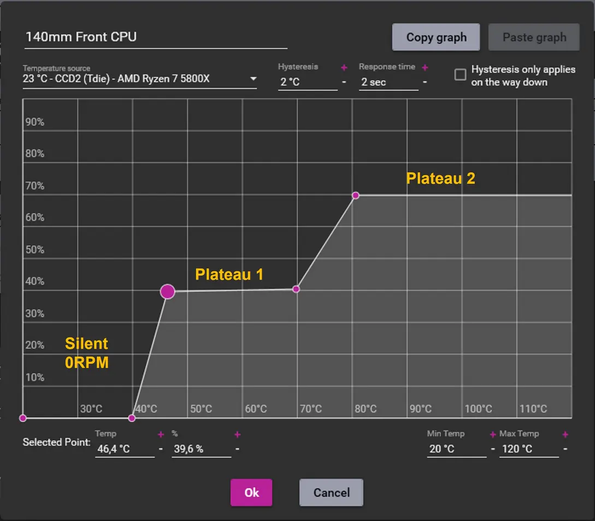

+++
title = 'the journey of noise'
date = '2025-03-01'
draft = true
+++

I'm autistic! Noise affects me more than the average person. I often fantasize about going deaf. \
After always having laptops, recently I finally got my first pc! \
Little did I know how LOUD it can be...

Let me take you on a journey of how I dealt with the devil that is **noise**.

# first impression

I plug in the computer and start going through the motions of initial setup. \
Despite being distracted by my horrendous monitor (and the following two, before I got my 4th one which is great; but that's a separate story), what was even more clear is how LOUD the fans were.

Thankfully my partner is goated, and thanks to it I know that a "fan curve" is a concept that exists. \
You can define the rotation speed for your fans, depending on the current temperature of your cpu. \
(That is both wrong and inprecise, keep in mind I'm telling the story as I knew things at the time, I now know more).

You do this configuration in the BIOS. The place you get into by mashing (usually) the <kbd>Delete</kbd> key when rebooting. \
As I was looking through the settings, I got surprised at how many more there were, compared to my laptop! No wonder though: with more replaceable parts that you have in a proper computer, there is also more opportunity to configure them all. \
But despite the amount of extra settings, I never found the dreamed fan graph.



I was only able to find the overall "modes" that also happened to affect fan speeds: Normal, Turbo, or Silent. \
Picking the Slay the Spire character in my bios didn't help make things quiet, though. Both fans were still overwhelmingly loud, at ~1800 rpm.

I removed the exhaust fan, but there isn't that much noise difference between 2 1800rpm fans, and 1 1800rpm fan — it's loud as hell regardless.

I know that's it's a "bad idea" or whatever, but what if remove the cpu fan too, and let the heatsink do all the work? I just need it to not *over*heat for now, so maybe it'll be fine? \
I do exactly that and then cautiously stare at the cpu temperature while in bios.

> Sure, the temperature rises, but very slowly! Maybe this will work out?

Is what I think, but eventually it gets to 70°C. Nope, this is not viable :c

I put my pc to sleep. I can't use it like this, I'll fucking die! \
I put off the setup process for when I figure this out.

# oh that exists?

There are certain expectations I had of a working computer, and a couple of them were broken. \
The computer I bought isn't new, but instead made by some cryptomining guy.

First I realize that the pc doesn't have wifi! Wtf! \
I went and bought an Ethernet cable (😭 it's actually called dog8 😭 <- you probably), pathed the snake from the router to my room, and got myself internet. \
As a result, my internet is now way faster and more consistent than it used to be before, so I'm happy I did that rather than buy a wifi adapter, but I'm still surprised that missing one was a possibility.

Similarly, there was no bluetooth adapter. Thankfully my headphones (JBL Tune 750BTNC) can also be wired, so fixing that issue wasn't a rush.

Oh and I forgot to mention: the pc didn't come with a power supply plug. Yeah, even something that simple wasn't there.

That's why I got a hunch that the fans were shitty as well. \
I go through fans I could buy to replace the existing ones, and notice an interesting metric: minimum rpm. \
And then it hit me: my fans' minimum rpm was fucking 1800!!! No wonder they were loud :o

Later on I figured out the extra factor of their shittiness: it's not that their minimum rpm is so high, it's that their rpm isn't *controllable*: they're missing "PWM". \
PWM is a thingy (don't ask me) that lets your motherboard control the speed of your fans. Since my fans weren't PWM, they couldn't change their speed, and *that's* why they have the 1800 minimum: it's also their maximum!

So I was looking through fans that had a low minimum rpm (I didn't quite get the pwm memo at the time), and noticed that for the most part, 500 was the lowest they went.

Now, aside from product availability differences (I'm in russia 😭), I *was* stupid: I didn't just buy a fan, I bought a whole ass cooler. \
See, I already have a heat sink on my cpu, and it at least looks very nice and capable. Especially so for my needs, and I imagine the cryptomining guy had higher cooling needs than me. \
So instead of buying *just* a fan, I incorrectly searched and found heatsink + fan combos.

Anyway, I take just the fan part from the combo, after realizing my mistake, and try to attach it to my heatsink. \
The heatsink uses these interestingly shaped metal holders that you're supposed to grab onto the fan to hold it in place; my new fan didn't have anything to hold on to, though :c

And here we go 😈 \
In my classic fashion, I decide to do some redneck engineering, and pull out the zip ties 🗣️🔥


Blammoing a ziptie around the fan and heatsink to hold them together turned out to be far more effective than I expected! Now *this* is starting to look like my setup :D

Using *just* the cpu fan for my entire pc's cooling (aside from gpu's builtin fans) feels assy, but it's something I can at least fix later — if this new fan is sufficient for the cpu cooling, then I'm set to actually use my pc comfortably!

# comfortably, right?

It definitely got quieter! But not exactly *silent*.

I came back to the bios to see 1200rpm. Didn't expect that last 600 to make such a big difference! \
However, this is still not the 500 minimum I was promised. It definitely seems like a configuration issue 🤔.

Remember those bios modes? Normal, Turbo, and Ironclad? \
Interestingly, despite *everything* being in Defect mode, Watcher didn't affect the fans as much as it could: fans also have modes of their own! :o

After setting the fan mode to Silent too, it got down to 900rpm. Another significant improvement, although not as huge of a jump as 1800 -> 1200. \
Still, that's no 500! And I'm determined to get it.

There is something even more forcing than Ironclad: *Manual* mode. \
Aha! This must be my motherboard's way of setting the fan graph! \
Although, it's not as clear or understandable as your normal fan graph: you don't get a visual representation of how the speed *rises*, and the wording is confusing, especially to someone who doesn't know how this works prior.

For example, in a normal fan graph, you can make your fans not spin at all (!!) before the cpu reaches 40°C, then start spinning them at 500 before 50°C, then linearly increase their speed until 70°C, and then make a **steep** rise once the temperature reaches more than that.

My motherboard doesn't support such fine grained control. Most cryingly, it doesn't allow my fans to have *no* rpm under a certain temperature :c

Sure, now that I have literally just a single fan, I *should* always have *some* rpm at least, but in the future when I buy better and more fans, kinda sad to be required to always spin them :c

Anyway! The method I have access to is the following:

1. set the maximum temperature, after which the fans spin at maximum speed
2. what is the maximum speed, in that case?
3. set the minimum temperature, ***before*** which the fans spin at minimum speed
4. what is the minimum speed?

Initially, it's worded more confusingly and it's never mentioned how the rpm changes *between* the minimum and maximum temperature. My guess is that it's linear, but I don't actually know. A fan graph would make this clear *and* configurable.

{{ hr(id="temperatures") }}

I have no clue what temperatures are "good". I never had the ability to optimize fan speed, and so I never had a reason to monitor temperatures. \
The information I've been able to find is that "as long as you're under 90, you're fine!" but that's not very helpful! I won't listen because that *sounds* like awful advice! \
Chatgpt told me that 30-50 while idle and 60-70 while under load is a good spot. \
But first, trusting an ai on this isn't the brightest idea; even if I do, 30-50 is an awfully big range! And what does "under load" mean? Is watching a youtube video considered "load"?

I asked a more trustworthy robot about this, and turns out setting minimum temperature to even 60°C is fine! :o

That's very good to know, but to be really safe, I put down my minimum temperature to 45°C, and maximum to 60°C, rather than the 30°C minimum I set at first. \
Maximum speed to 100% — temperature over 60°C should never be reached, and if it is, I'm afraid of it; so a lot of fan noise *sometimes* is a good deal to help my anxiousness, while having as little as possible fan noise in the general case.

I mentioned that my bios doesn't let me completely stop the fans under a certain temperature. This is because even in manual mode, I cannot set the minimum speed to less than 20% — the bios doesn't allow accept the value. So, even under the minimum temperature, the fans will spin at at least 20% capacity. \
Which suuuuuucks 😩

The fan is audible, and it really shouldn't be when my temperatures are super fine. I got my desired 500rpm, but it turned out it's not ideal...

In the same store where I couldn't find fans under 500rpm, my partner *was* able to! She found 200rpm minimum fans :O \
I know what my next goal is now 🔥🔥🔥

# voiding the warranty

After some time I was able to purchase that 200rpm fan, and replaced the previous cpu fan with it. \
My expectation was to get a completely silent computer, but in reality I only got a marginal benefit.

...How is that possible?

You see, gpus tend to come with abhorrently bad fans. They end up producing the majority of the noise, mostly counteracting your otherwise quiet fans.

Alright, time for more redneck engineering! But far more scary now!

I will remove the plastic container from my gpu, and instead of the fans that come with it, I'll blammo in the previous cpu fan that I have no use for now, by using a zip tie once again.

Sounds like a dangerous idea, right? \
At that point in time, I was monstrously exhausted from constant noise, and if suddenly my computer stopped working, I wouldn't even be that anxious about it. I was really really exhausted with the constant overbearing noise that my computer made, so I was willing to take a bigger risk than usual.

I power off, and remove two random wires (I later realized they're connecting to the psu), placing them in a way that would help me remember how to plug them back in. \
Then, I remove the gpu from its socket. So far so good.

The first two screws that were holding the plastic together with the rest of the gpu were very easy to reach, but the other two were positioned "inside", where I couldn't reach them normally. \
To get to them, I have to unscrew the 4 screws on the bottom of the gpu.

I get to doing exactly that and see a small sticker on one of the screws: "unscrewing voids warranty". \
This is a used computer — I don't *have* warranty. Reading it still sent chills down my spine. Ack!

After removing the plastic, I was expecting to see a 4-pin port for the fan. I did see a port, but it was actually *5*-pin! \
As usual I ask chatgpt on advice, and the tldr is "it's fucky, don't bother". \
Well shit, how do I cool my gpu now?

The cpu fan is connected to the cpu port. What that actually means, is that the hotter my cpu is, the faster the fan will spin. \
Not being able to use the gpu port removes this flexibility for the gpu cooling. \
For most of my usage, I can just set the gpu fan to like 700rpm and that'll be fine. But if I open a game, the fan won't react to the much higher load!

To add more flexibility (although still wonky of a solution), I'll plug the gpu fan into the cpu fan port. My reasoning is that if the gpu is getting hotter, the cpu probably is too! The cpu fan will start spinning faster, and so will the gpu fan. Hopefully it's going to be good enough?

To make sure, I made this loop in fish shell, that would play a soundeffect if the gpu's temperature went to or over 75°C, and then started playing Dishonored to test it.

```fish
while true
  test (cat /sys/devices/pci0000:00/0000:00:01.0/0000:01:00.0/hwmon/hwmon4/temp1_input) -ge 75000 && paplay ~/m/soundeffects/camera-shutter.oga
  sleep 10
end
```

Fascinatingly, I never heard the sound effect, in even 30 minutes of playtime! So it seems like this cooling setup is good enough :D

# but not forever

While this works, I feel it would be both dangerous and stupid to leave it be like this till the end of time. \
After all, the gpu used to have *two* fans (although smaller), and now I only have one. \
To make sure that the cooling is good enough, I think it's a good idea to *over*cool the gpu, so that even in the worst case scenario (only gpu heats up but not cpu) it's not going to overheat.

Some time later I bought another 200rpm fan, and replaced the 500 one with it. \
Just to test! Before I'd eventually add back the 500rpm fan. \
But I ended up noticing a very interesting effect! For the first time ever, my fans started spinning *slower* than 500rpm! :o

It turns out that the 500rpm fan, because of its minimum, was *speeding up* the other, 200rpm fans. \
Also, after removing the 500rpm fan, things got significantly quieter! \
It turns out that most of the noise was coming from not from the rpm specifically, but from the 500rpm fan being *smaller* and *shitter*.

I later learnt that the bigger the fan is, the quieter it is while transporting the same volume of air. \
The smaller fan was both trying harder, *and* doing a poorer job! \
I got to confirm that after testing my temperatures again, with *only* the new bigger fan, and saw that my temperatures were *lower*! \
Matter of fact, surprisingly significantly lower! At this point I don't *need* the previous fan at all!

# physical equality

At the time of me writing this blog post, I do still only have the two 200rpm fans. I plan to buy two more: one exhaust fan, and one intake fan. \
However, I found something on the *software* side that let me eliminate the gpu temperature flexibility worry *completely*.

`fancontrol`. \
A program you can run as a service, that changes your fans' speeds depending on the temperature.

I actually knew about it way at the start of the pc journey, but I couldn't get it to *work*. \
And my thought process was that even if I *did* get it to work, it wouldn't allow me to have no rpm anyway, since in my head it was my motherboard that completely didn't allow that to happen.

Thankfully, I was very wrong! But god, was it a spiky path to set it up. Even now, I'm not *exactly* sure of all the steps I took to make it work, but here are the basic ones (on arch):

Install `lm_sensors` and run `sudo sensors-detect`. \
This will allow you to run `sensors`: a neat program that shows you various information about your system. Here's my output:

```
amdgpu-pci-0100
Adapter: PCI adapter
fan1:             N/A
edge:         +39.0°C  (crit = +120.0°C, hyst = +90.0°C)

coretemp-isa-0000
Adapter: ISA adapter
Package id 0:  +41.0°C  (high = +80.0°C, crit = +100.0°C)
Core 0:        +39.0°C  (high = +80.0°C, crit = +100.0°C)
Core 1:        +40.0°C  (high = +80.0°C, crit = +100.0°C)
Core 2:        +40.0°C  (high = +80.0°C, crit = +100.0°C)
Core 3:        +37.0°C  (high = +80.0°C, crit = +100.0°C)

acpitz-acpi-0
Adapter: ACPI interface
temp1:        +27.8°C  
temp2:        +29.8°C  

nct6791-isa-0290
Adapter: ISA adapter
Vcore:                 888.00 mV (min =  +0.00 V, max =  +1.74 V)
in1:                     1.03 V  (min =  +0.00 V, max =  +0.00 V)  ALARM
AVCC:                    3.33 V  (min =  +2.98 V, max =  +3.63 V)
+3.3V:                   3.33 V  (min =  +2.98 V, max =  +3.63 V)
in4:                   1000.00 mV (min =  +0.00 V, max =  +0.00 V)  ALARM
in5:                     2.02 V  (min =  +0.00 V, max =  +0.00 V)  ALARM
in6:                   808.00 mV (min =  +0.00 V, max =  +0.00 V)  ALARM
3VSB:                    3.41 V  (min =  +2.98 V, max =  +3.63 V)
Vbat:                    3.28 V  (min =  +2.70 V, max =  +3.63 V)
in9:                     1.02 V  (min =  +0.00 V, max =  +0.00 V)  ALARM
in10:                  224.00 mV (min =  +0.00 V, max =  +0.00 V)  ALARM
in11:                  184.00 mV (min =  +0.00 V, max =  +0.00 V)  ALARM
in12:                  1000.00 mV (min =  +0.00 V, max =  +0.00 V)  ALARM
in13:                    1.03 V  (min =  +0.00 V, max =  +0.00 V)  ALARM
in14:                  232.00 mV (min =  +0.00 V, max =  +0.00 V)  ALARM
fan1:                   793 RPM  (min =    0 RPM)
fan2:                   818 RPM  (min =    0 RPM)
SYSTIN:                  +8.0°C  (high =  +0.0°C, hyst =  +0.0°C)  ALARM  sensor = thermistor
CPUTIN:                 +37.5°C  (high = +80.0°C, hyst = +75.0°C)  sensor = thermistor
AUXTIN0:                +36.5°C    sensor = thermistor
AUXTIN1:               +101.0°C    sensor = thermistor
AUXTIN2:                +99.0°C    sensor = thermistor
AUXTIN3:               +101.0°C    sensor = thermistor
PECI Agent 0:           +37.0°C  
PCH_CHIP_CPU_MAX_TEMP:   +0.0°C  
PCH_CHIP_TEMP:           +0.0°C  
PCH_CPU_TEMP:            +0.0°C  
PCH_MCH_TEMP:            +0.0°C  
PCH_DIM0_TEMP:           +0.0°C  
intrusion0:            ALARM
intrusion1:            ALARM
beep_enable:           disabled
```

Most things are either invalid or useless, but some values are actually of use to us. \
All the values here are actually read from device (?) files, so if you run `sensors -j`, you'll be able to find those paths, to be used in your waybar or something like that.

Under `amdgpu-pci-0100`, we see that my gpu likes edging, but it's not very hot because of that yet. You probably have a different gpu than me, so you'll likely see a different section name, but should be able to find it pretty easily. I assume it'll have `gpu` in its name still. \
`coretemp-isa-0000` is the temperature of the actual cpu. But according to chatgpt (lol), you're not meant to use that temperature reading for cooling purposes, and should instead consider `CPUTIN`. \
Right next to it, we also see `fan1` and `fan2`, with their speeds in rpm. \
`sensors` is how I did all of my temperature testing throughout this blog post.

Now that you have the sensors working, you should run `sudo pwmconfig`.
