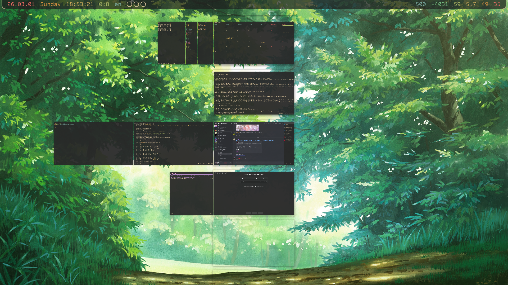

+++
title = 'nirism'
date = '2026-03-02'
+++

I've been using niri for a bit over a year now, and yet still I have a soft cap of windows I'm able to open before I'm completely lost.
Almost assuredly a skill issue on my part — I know people who have around a HUNDRED windows open at a single time, so there must be some way for me to gain the power too, right?

Recently I made some pushes on configuring my workflow to allow me to manage more windows, easier.

# overview

When the overview first came out, I was excited about it but towards my **friends**, not towards myself.
It didn't sound useful to *me*.
I added a hotkey for it sure, but then continued to basically never use it.
What's the issue then?

Part of it is effort.
I open the overview and sure, I see some windows around the current one, but not *that* many.
It helps me find myself a bit, but with the limited value it provided it was hard to mentally argue with myself to press the separate hotkey for it.

You can, however, change the *zoom* level of the overview, to be able to fit more windows at once.
I thought at first that it's not that good of an idea because then there's less *detail* for me to use to discern windows, but no!
Especially thanks to another thing I'll talk about later in this blog post, reducing the zoom level has made the overview **much** more useful to me.

I configured the zoom to fit ~2.5 workspaces both above and below.
In effect, now when I open the overview, I can see almost *all* of my opened windows!
Finally, the overview is doing its job — being an *overview*.



In contrast, the default zoom level looks ridiculous, in how much less useful it is.
But there's reason for it being that way — you see, all of your window-managing hotkeys **do** work in the overview as well.
You can close, consume, expel, move windows, workspaces, and more.
Normally that can get a bit confusing, especially if you try moving workspaces (no animation for that) — but if you do it from the *overview*, suddenly things are a lot easier to visually track, because you have a bigger surrounding context.
Then with most people only using 1-3 workspaces, you don't need to zoom out that much to get the benefit, so I'm guessing that's why the default zoom is so close.

For me though? Zooming it *out* was the solution.

Secondly, the hotkey I chose for it at first was kind of eh.
There's an idea I like to talk about in Hotkey™ Theory™ — “sequentiality”.
The hotkey should be pleasant and ergonomic not just in a vacuum — when thinking of the hotkeys you create, you should also consider what *other* hotkeys may come before and after it.

With the overview, right after opening it I might move ←↓↑→, to different windows and workspaces.
With moving bound on <kbd>Meta+hjkl</kbd>, and the overview being bound on <kbd>Meta+o</kbd>, the sequentiality is poor.
I can't *quite* move to the window on the right, right after opening the overview — I must move my finger from <kbd>o</kbd> to <kbd>l</kbd> first.
There are much poorer sequentialities out there so this comparatively is not a big deal, but it was still contributing to my “eh”ness about the overview.

I rebound it on <kbd>Meta+Space</kbd>, and now *that* feels a lot better.
Normally I dislike using <kbd>Space</kbd> in hotkeys because of how *massive* it feels to press, but for the overview that actually works in its favor.
It already *feels* like a “large” action, so pressing a “large” key to get access to it makes sense to my fingers.
And then of course the better sequentiality.
Right after pressing <kbd>Meta+Space</kbd>, I can without moving any of my fingers, move ←↓↑→ to windows and workspaces, at max comfort!

After doing these two changes, I actually started seeing myself use the overview a lot more.
Really nice tool for “finding yourself” so to speak.

# workspaces

The next part that makes it easy to get lost, is how many windows I may open on a single workspace.
I start some sort of workflow; let's say I'm working on my [gtk theme](https://github.com/Axlefublr/gruvbox-material-gtk-theme) (probably soon discontinued).
I'll wanna open `gtk3-widget-factory`, then maybe another gtk window where I'm testing something specific I can't find in `gtk3-widget-factory`, a terminal for `pastel`, a terminal where I wanted to run some one command and forgot about, a window where I'm checking the docs on `waybar`, “whoops I want to check what chores I need to do today”, and so on and so forth.

A given workflow may create a bunch of windows.
A couple of them are valid, but some other ones are in the way.
The “some one command” terminal needed to exist for a second, but afterwards it remains to be clutter.
If I realize I want to run another some one command, by that point I might've forgotten that I already have a terminal for that, and so I'll likely open another one.
This specific usecase I'll talk about in a later section, but what is very of interest for now is the doc window on waybar and chore tracker.

It would be pretty nice to have auxillary windows like that to all be in the same spot, rather than riddling the workspace where I'm working on a given thing.

In niri, when a window spawns, it spawns on the current workspace.
You can make a window rule to make it open on a *different* workspace, as long as that workspace is **named**.
And so, I create 5 workspaces, all named: one, two, three, four, five.
Pretty much just so that I could use them in window rules.

I considered at first to then make hotkeys that activate a specific workspace, but soon gagging from the memories of awesome wm, I realized I quite dislike it.
A real nice thing about niri is its dynamicness; I want to retain that part and play into it, so my main form of navigation remains directional.

One change that I *did* add though, to aid moving across now more workspaces, are hotkeys to go to the first / last workspace, and hotkeys to go to the first / last column.
The latter ones I already noticed myself wanting many times in the past, but the workspace ones are a bit more questionable in terms of usefulness.

So, my named workspace layout is as such:
```
three
two
one
four
five
```

Workspace one is the middle one, the “first” (top) one is three, the last (bottom) one is five.
I still can create more workspaces if I need them — I simply create a window on the automatically created workspace beyond `three` or `five`.
Playing along niri's dynamicness.

Workspace three will now hold a bunch of my “status” windows so to speak.
Currently on it I have open my chore tracker, calendar, a reminder thingy, a bluetooth tui, and a helix where I'm calculating my earnings.
All except the last one I window rule to *always* open on that workspace, so now when I suddenly decide to check what chores I have to do today while working on some project, that window will not get created in the midst of a bunch of other stuff, but instead get moved onto the workspace *specifically* for status windows, helping me stay more organized.

Similarly, documentation windows{{fn(i=1)}} I window rule to always appear on workspace five.
Way easier to keep track of, not get lost in, and eventually clean up.

{{hr(id="startup")}}

What named workspaces also allow me to do, is create more windows on startup.
Previously I wouldn't want to do that, because a bunch of the windows would be created on the main workspace, when I prefer to keep them on some other one.
But now I can actually express it!

On login, the reminder thingy, chore tracker, calendar is created onto workspace three.
Yazi opened in the anime directory and anki on workspace four.
Yet on the main workspace, workspace one, I still start out with my terminal window and the browser.
Less things to have to create manually! Pretty nice.

# togglies

Windows are automatically grouped together now thanks to named workspaces, but the issue of duplicates remain.
The chore tracker is started on login, but I also have a hotkey to open it.
It's plain easier to press that hotkey than to navigate to the existing window, and afterwards I may forget to close the new one, resulting in a duplicate that will help me get lost.

I have quite a bunch of hotkeys that create some window, actually.
And so, I decided to make their behavior a bit smarter.

1. If the window doesn't already exist, it's created
2. If it does exist but isn't focused, it's focused
3. If it **is** focused, the most recent window is focused instead.

I expressed this via a fish + nu script:
```fish
#!/usr/bin/env fish

set -l wheres
for arg in $argv[..-2]
    set -a wheres "| where $arg"
end
nu --no-std-lib -nc "
    let found = niri msg -j windows
    | from json
    $wheres
    if (\$found | is-not-empty) {
    	if (\$found | any { get is_focused }) {
    		niri msg action focus-window-previous
    	} else {
    		\$found | first | each { niri msg action focus-window --id (\$in | get id) }
    	}
    } else {
        niri msg action spawn -- $argv[-1]
    }
"
```

How to convert it to bash + jq is left as an exercise to the reader.

The full command to give the chore tracker toggly behavior, for example, looks like this:
```sh
find-or-make.fish "app_id starts-with foot" "title == loago-tracker" "footclient -NT loago-tracker fish -c loago_tracker"
```

First, an array of nushell `where` checks to identify the exact window.
And as the last argument, the command to use to create a new window.

Now whenever I want to check my chores, I press <kbd>h↓s</kbd> once to take a looksie, then press <kbd>h↓s</kbd> again to go back to what I was doing.
No new window is created if the tracker already exists, no mess is created for me to get lost in.

I used to have this kind of workflow back on *windows* with autohotkey actually.
Not sure why I haven't replicated it in so long, I remember absolutely loving it.
I get to love it again 😌

A lot of my windows I can now target directly.
Most windows on workspace three, for instance.
Which makes me realize that there are only a few windows on that workspace that I'd want to focus via normal means.
So if I put all of the “other” (without a direct hotkey) windows at the start/end of the workspace, I can use my hotkey to go to the first workspace followed by a hotkey to go to the first/last column, and that way I can quickly jump to the “other” windows that are otherwise maybe annoying to reach.
The windows in the *middle* are then ones that I have direct hotkeys for, so them being more difficult to reach, compared to the first/last windows, is not a big deal.

The first/last column and workspace hotkeys I all have on <kbd>we↓</kbd>, so the sequentiality of going to the first workspace and then moving to the start of it is *fantastic*.

Some windows prefer to be closed rather than stay open, though.
[bluetui](https://github.com/pythops/bluetui), the bluetooth tui I'm using, likes to get fucked up if left unsupervised, for some reason.
So instead of just toggling away from it, I'd want to close it.

So this ↓
> 3. If it **is** focused, the most recent window is focused instead.

I want to also close the window afterwards.
This idea is still in the process though, I'll either add some flag to the `find-or-make.fish` script above, or I'll make a separate hotkey to express the concept of “switch to the most recent window, close the window you just switched away from”. \
“Doesn't this already happen when you close a window?” you might rightfully ask — not *quite*!
The most recent window *on that workspace* is activated, rather than the global most recent window.
Reasonable behavior, mind you, but keeping recency correct has recently become significant for me, which we'll talk about later.

The biggest usecase for `find-or-make.fish` is a toggle *terminal*. \
All those one-off commands I might run and come back from?
I can now press <kbd>Meta+Enter</kbd> to activate my permanent-staying toggly terminal, then press <kbd>Meta+Enter</kbd> again to come back to where I was.

In the past, I had a hotkey that created a *floating* terminal, for a similar usecase to this.
It resolved the need somewhat, but had some downsides.
Due to it being floating, I kinda need to “handle” it immediately — if I don't close it after I run my command, it'll be annoyingly in the way.
That's part of the intention yes, but there are some cases where the command I run takes some time to complete, and I don't care to *wait* for it to complete — I just want to make sure I start it.
Other times, the output of the command is unbearable to view in the *small* floating window.
Making the floating window **big** instead makes it kind of confusing to work with.

So a normal ass terminal I toggle into is a much better approach I think 😼
As a side benefit, I get to *keep* old output, for me to possibly look at multiple times, rather than discarding it every time by closing the window.

# alt tab

Is another niri feature I was excited for, but for my *friends* — not myself.
But also, I was *surprised* that it became part of niri upstream.
In niri, to get to windows you almost always necessarily focus multiple windows on the way, so alt-tab functionality sounds so off, right?
The small but ridiculously important caveat here is *debounce* — a window is not added into the most recently used list if you've spent less then x milliseconds focusing on it.
You can configure the x of course.

But the thing is, I don't really think about my windows in terms of recency, I think about them in terms of geography.
*Where* they are, rather than what was the window I was just using.

Another skill issue of mine, I bet!
Just like many other things I trained my brain to be able to do, [home row mods](@/erm/index.md) being the wackiest one, I can probably train my brain to think in the recency plane as well :3

I've tried using the feature once before in the past to no avail, but this time is a bit of a changed circumstance — now that I always have *5* workspaces (or more!), to move through, using the recency plane to switch between them quickly becomes a lot more juicy.

Imagine I'm on the second workspace, open the docs for something, and want to move back.
Currently I'd need to move to the above workspace *thrice*, or go to the first one and move down once.
Neither are particularly pleasant!

But with alt tab, I can jump back in one fell swoop, with a nicer *semantic* to boot — what I want to express, after all, is “bring me back where I just was”.
When I realized that *that's* what I mean, I was sure my brain would adjust to the recency plane pretty well.

But there's some more configuring work to do on alt tab before I find it truly viable.
As I started using it, I very quickly noticed that it's hard to *anticipate* the next window in it.
When you select the window on the right of your screen, you only see a small sliver of what the next window is.
Basically never enough to be able to tell ahead of time how many “next window please”s it's going to take to get to the window that you want.
To see what the next window is, I need to “next window please”.
Then if I went too far, I need to manually go back 🙄

I realize that what I want is for the selected window to always be *centered* in the alt tab ui.
And that's exactly what I did!

{{video(path="centered-mru")}}

You can find the patch in my [niri fork](https://github.com/Axlefublr/niri) or in [this thread](https://discord.com/channels/1387519366651842574/1476954416753147986) on the [niri discord server](https://discord.gg/dxEHRDCcEC).

Now as I go through windows in the ui, my brain can preprosses how many more times I need to press my hotkey, as I can see a lot more windows ahead of time.
As opposed to pressing the hotkey, going “nope, not that one”, and pressing it again — which is an annoyingly start-stoppy workflow.

Notably, I reduce the zoom level here too, to be able to see more windows at once.
Here, losing the detail by zooming *out* matters reasonably more than in the overview.
To make the tradeoff worth it, I have some tips and tricks I'll talk about in the next section.

Another feature alt tab has to try to be less annoying, is that the ui only appears after x milliseconds.
Reasonable once again, but what I found is that I'm not *that* annoyed about the ui popping up every time.
Yet it appearing *immediately* is actually really useful because I can start the brain preprocessing step earlier, helping me navigate in the recency plane better ✈️ \
Rather than it being *only* a switcher, it suddenly becomes another form of overview — but instead of geographical, it's based on recency.

I'm still human though, so for the cases where I switch between only two windows over and over again, I gave myself a separate hotkey that does just that, using the `focus-window-previous` action that doesn't even use the alt tab functionality (and hence ui).
This also means that it doesn't have the crucial debounce, but should be worth it still.

# makeup

When all of your windows are the same size, they become hard to distinguish.
Especially when (almost) all of your windows are just terminals: text just looks like text a lot of the time.

But if they are of different *sizes*, they are a lot more immediately distinguishable, in alt tab, overview, and even just as you scroll through the windows naturally.
Sometimes that even results in you fitting more windows at once, as a side benefit.

I have hotkeys that change a window's bigness by 5%, and for a while I underused them for reasons I didn't quite get.
I use [home row mods](@/erm/index.md), and so to effectively hold some key, I need to tap it and *then* hold it.
Normally not a big deal, but for incremental hotkeys like 5% bigness changes, you *really* want to be able to hold them immediately.
With a low repeat-delay and high repeat-rate, suddenly that turns into a fantastic experience.

I rebound them on keys that *do* immediately get the hold behavior, rather than being tapholdies, and now I can ergonomically *whoosh* windows to my prefered size, followed by a few small correcting resizes.
Wonderful.

Especially (more realistically, *mostly*) for terminal output, I might run some command and wanna store it for later.
I run the command, resize the terminal to only as much space as it needs (maybe making it *bigger* instead, actually!), then maybe throw it on workspace five, to get to later.

There are a lot of windows that I want to *always* have the same size, though.
The reminder, chore tracker, yazi for anime, etc etc.
So! I can create window rules for those windows, sizing them some size automatically.

On the path of doing that, I also need to *name* those windows something specific, so that making window rules for them is straightforward.
But the incidental benefit I get from it is that now a lot of my windows are named more *usefully*.
When I see them in alt tab, not only does their size help me preprocess them, but also the window title I see makes things a little easier.

Taking care of your sizes and titles is the big reason why zooming out even the alt tab ui, I found to be a worthy tradeoff.

{{hr(id="henceforth")}}

With all of these changes, I'm starting to get more comfortable managing *more* windows at once, and don't feel as forced to close windows immediately.
Still trying things out, but I think this has been an awesome push to make use of moar power that niri has :3

# footnotes

{{hn(i=1)}} I have hotkeys that open `man …` / `… --help` / `nu -c '… --help'` in a new window, either through helix or [ov](https://axlefublr.github.io/ov/).
