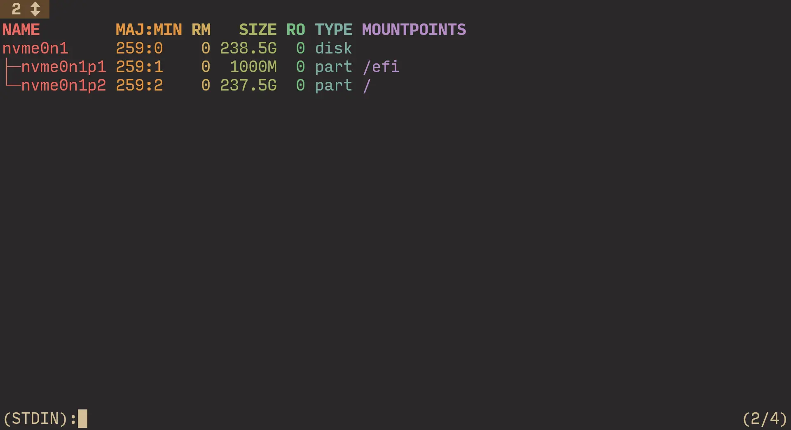
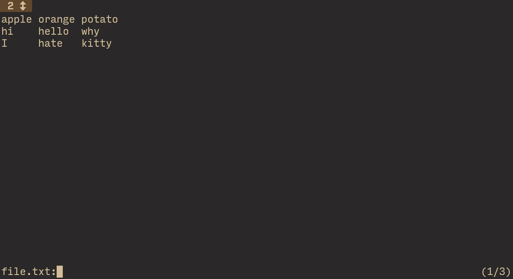
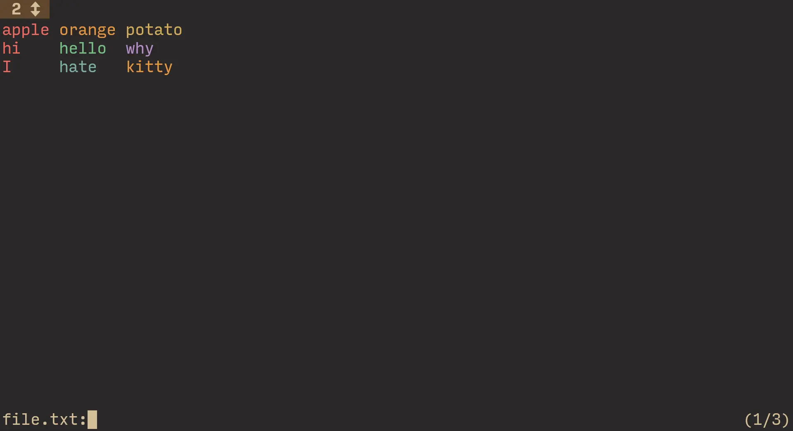
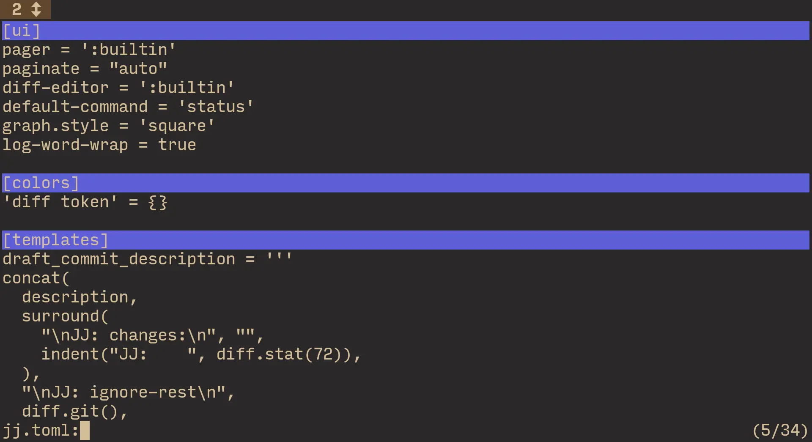
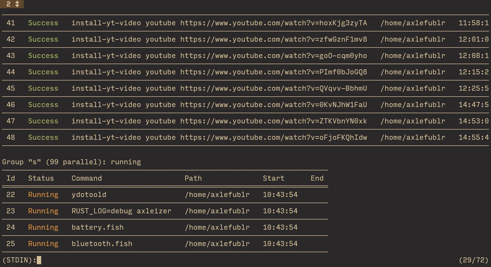

+++
title = 'finally, a good pager'
date = '2025-01-11'
+++

Some time ago, I tried looking for a pager, and found... nothing?
How are we content with `less`?

[`bat`](https://github.com/sharkdp/bat) comes up a lot, but it still uses less under the hood as far as I know.

It gives you syntax highlighting, which is nice, but that's the last nice thing about bat that I encountered.

That syntax highlighting? Automatically uses a custom theme, instead of trying to use your terminal theme.
Blammoes a big ass header for the filepath that you opened, and takes up like 4 columns for the line numbers.

"You can change that though" is not really a point: if a program has defaults like these, it's clear it's not doing what I want from a pager.

I want more *functional* bells and whistles, rather than visual ones.

And today, I finally came across a pager that satisfies me.

# ov

[`ov`](https://github.com/noborus/ov) is my new favorite puppy.

It introduces a few cool concepts that make it *sometimes* better than your editor! (For viewing files)

## headers

Headers are basically "sticky lines", that are fixed at the top and shown always, as you scroll through.

Very useful for programs with columnar output that display the column names at the top, for example!

```fish
lsblk | ov --column-width --column-rainbow -H 1
```



Well, if you have enough output from `lsblk` to fill more than a screen, I think you're cooked 💀. But you get the idea: `-H n` to set `n` first lines to always display at the top.

## columns

In the above screenshot, each column in the output of `lsblk` is colored thanks to the `--column-rainbow` flag.

`ov` has the concept of columns quite engrained into its functionality. \
You can decide how to split into columns based on width or a delimiter character (/ regex). \
Even nicer than that, you can align input into columns even if it is not aligned in the source.

Say I have this file:

```
apple orange potato
hi hello why
I hate kitty
```

As you can see, it has three columns, but they aren't aligned. Let's use the `--align` flag to fix that!

```fish
ov --column-delimiter ' ' --align --column-mode file.txt
```



However, here's an interesting behavior:

```fish
ov --column-delimiter ' ' --align --column-mode --column-rainbow file.txt
```



It seems that if your delimiter (a space) is the same as the aligning character (a space), `--column-rainbow` doesn't work how you'd expect. Oh well.

## sections

Sections are what excites me most about `ov`.

Basically, you can specify a regex that defines where to split the input / file at; you can then press <kbd>^</kbd> / <kbd>Space</kbd> to navigate to the previous / next section.

```fish
ov jj.toml --section-delimiter '^\['
```



So using sections, you have a nice semantic way to jump between important parts of a file! \
An example of where that is going to be most useful to you, is for *diffs*. \
You simply define something like `^diff` and blammo, you can jump across the diffs of multiple files in a very easy way.

About that "very easy way" though. \
Yes, it's genuinely <kbd>^</kbd> and <kbd>Space</kbd> by default.

Unfortunately, ov has a habit of having ass / unexpected default mappings. \
For example, <kbd>j</kbd> and <kbd>k</kbd> don't work. Yes really!

And that default section header color is quite not readable; I don't see what white you need to use for it to be readable.

However, a *good* habit that ov has, is that you can configure everything! \
You can configure the colors that it uses (for example, the `--column-rainbow` colors are those that I set myself), and the hotkeys. So, I'll definitely spend some time reworking like, *all* of them, lol.

However, if you like `less` mappings (or just can't bother), you can copy a config they suggest in the readme, that mimics `less` mappings closer.

## filtering

As you would expect, you can search with <kbd>/</kbd> and <kbd>?</kbd>. But that's a given and not very interesting.

What I find to be more interesting, is *filtering*.

Using the `--filter` flag, you can make `ov` display *only* the lines that match a pattern; \
with `--non-match-filter` — display *only* the lines that **don't** match a pattern.

Essentially, you get `rg` for free!

Why not use `rg` directly you may ask? Because you can also filter *interactively*.

Although the default mappings are strange as hell, there is a default mapping for basically every flag!

Setting column mode, column mode by width, rainbow, delimiter, filtering and opposite filtering, searching (can be done with a flag btw), headers, sections, section headers, ...

Basically, in `ov`, if you can do something with a flag, you can generally also do it with a mapping. And vice versa. Very nice design!

## output on exit

With something like `less`, you view some output in a pager, and then never see it again ✨

To look at the output again, you need to re-execute the command that you piped into less.

`ov -X` will do something really neat: show the output in the pager, but *also* print it to stdout. \
So once you close `ov`, the output you were paging will get printed, letting you look at it while continuing to execute other commands.

You don't need to always `-X` though: use the `IsWriteOriginal` config option to set it to true, if you want. \
And you guessed it! You can *also* do this with a hotkey (<kbd>shift+q</kbd>)! Yes, really!

## don't even page

Similar to `less`, you can use the `-F` flag to not even open `ov` if the entire output fits on the screen. \
`QuitSmall` is the config option to set if it's the behavior you always want.

## tailing

You can use the `-f` flag to follow a file, similar to `tail -f`.

When it gets interesting, is that you can follow *multiple files at once* using the `-A` flag.

Rather than creating panes for each file (which I'd find annoying), it continuously switches to the file that got updated the most recently. \
So for example, you decide to `ov -A` 3 log files; new line appears in log 3 -> you get switched to look at it immediately.
Then, log 1 gets a new line -> you get switched to log 1 now.

Honestly a very neat solution that I like quite a lot. \
But if you don't, just keep using the `-f` flag and use <kbd>\[</kbd> / <kbd>\]</kbd> to switch between the multiple files.

The behavior of `-A` is so exciting to me: I *finally* have a good way to track log files :D \
I just specify a bunch of log files, and then can look at them *all* in realtime.

Better yet, `ov` supports suspending, so this works well in my [suspend-based workflow](@/suspend/index.md).

## word coloring

Especially in logs, it is common that coloring some words like `ERROR` and such is very helpful.

Use the `-M` option to specify a `,` delimited list of regex expressions that define what to color differently.

```fish
pueue status | ov --wrap=false -M 'Killed,Running,Queued,Success'
```



You also can use the `-e` option to execute the command *from* ov.

```fish
ov --wrap=false -M 'Killed,Running,Queued,Success' -e pueue
```

This way, you *retain* the colors that your command produces, and maybe add some more with `-M`.

Alternatively, you can use `unbuffer` to trick the program into thinking it's writing to a terminal, to retain its colors.

```fish
unbuffer pueue | ov --wrap=false -M 'Killed,Running,Queued,Success'
```

"Oh I sure do wonder where to install this useful-sounding program" — no clue, sorry. It's *somewhere*.

# check it out!

My goal isn't to teach you the entirety of `ov`, but to *sell you* on it. \
Go check out [the project's readme](https://github.com/noborus/ov) to learn about it more deeply!

I love how it's written: generally I get super overwhelmed when discovering a program of a certain bigness, but ov's readme is structured in a pretty nice way where I was able to learn it effectively!
