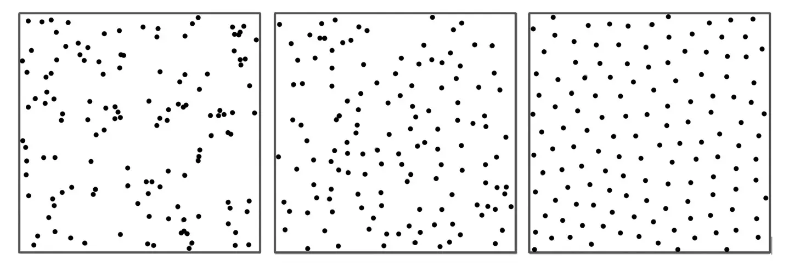

+++
title = 'randomization sucks'
date = '2025-03-25'
+++

You might instantly think that I'm going to be talking about how there's almost no *real* randomness in computers, and instead mostly pseudo randomization. \
Interestingly, I have the exact opposite issue: randomization feels *too* random!

Say you want to pick 5 random numbers in a range of 1 to 10. \
A fairly human sequence is something like this: [7, 5, 1, 8, 3] \
I simply put in random numbers in the range as they came to my head. Yet look how balanced they are! And no duplicates, too!

If you're tasked with picking random numbers like this, you're unlikely to choose duplicates. It simply feels unnatural to do. \
A *computer*, however, will have not mental blocks like that. You (unless trolling) are unable to produce the following set: [7, 7, 7, 7, 7]. \
Computers *can* (although it is very unlikely).

# perceived randomization



If tasked to distribute points on an area randomly, a human will probably start doing the 3rd option, think "wait I'm being too predictable" and switch to the second option. While in reality, true randomness will look more like the 1st option.

We expect randomness to behave in a spread out way, but that's not how it actually works! \
And it's the reason why normal randomness tends to feel kinda *incorrect*.

# shuffle

Biggest example of randomization feeling bad is the shuffle button in your music app. \
It will often feel like it has a preference for some songs, and never plays some others.

You start to shuffle some playlist with 100 songs and listen to 20 of them. Then you switch to listen to something else, and come back to the playlist, reshuffling it. \
You have now broken the shuffle, somewhat. Previously, in a singular shuffle, the music app wouldn't repeat the same songs until you've listened to them all. \
But because you *re*shuffled, it picks out of *all* 100 songs again, and because of true randomization that I pointed out in the above section, it very much might pick a song you listened like 5 minutes ago, rather than picking a song you haven't heard in a while, which would "feel" more random to you.

I have around 5000 liked tracks, so this issue becomes very noticeable at scale. \
This is why I created 50 playlists!

Say I added 10 more tracks to liked. \
The first one will go to playlist 1, the second one to playlist 10, 3 -> 19, 4 -> 28, 5 -> 37, 6 -> 46, 7 -> 5, 8 -> 14, 9 -> 23, 10 -> 32.

If I split 5000 tracks into *50* playlists like this, each playlist will have around 100 tracks, and the reshuffling issue ends up being wayyyyy smaller. \
Also I increment the next playlist by 9 rather than 1, so that none of the playlists have a "theme", or are discernable from one another, and feel correctly random.

# the point

Anyway, this is not what I actually started this blog post for, lol.

I got a recent obsession about wallpapers, as I made it so a random wallpaper would be chosen every day. \
As you'd expect, some wallpapers feel like they're picked all the time, while some others I never see.

So I thought: "what if I **ensured** this could not happen?".

My idea is the following: \
I'll have a cache that remembers how many times each individual option has been picked before. \
Before picking out of the options, we filter out all the options whose "count" is bigger than the minimum count of all the items.

Let's start with an example. We have four options: apple, banana, orange, tomato. All of them start with a count of 0, because none of them were picked yet. \
We begin the randomization process, and banana was randomly picked. Its count is now 1. \
We randomize again. We go through all the options and check the counts. We realize that the lowest count any option has is 0 (as every other option hasn't been picked yet), but banana has a count of 1. We filter out banana, and only pick out of apple, orange, tomato.

```
apple - 0
banana - 0
orange - 0
tomato - 0
```

lowest: 0. picking out of:

```
apple
banana
orange
tomato
```

banana. next iteration.

```
apple - 0
banana - 1
orange - 0
tomato - 0
```

lowest: 0. picking out of:

```
apple
orange
tomato
```

apple. next iteration.

```
apple - 1
banana - 1
orange - 0
tomato - 0
```

lowest: 0. picking out of:

```
orange
tomato
```

orange. next iteration.

```
apple - 1
banana - 1
orange - 1
tomato - 0
```

lowest: 0. picking out of:

```
tomato
```

tomato. next iteration.

```
apple - 1
banana - 1
orange - 1
tomato - 1
```

lowest: 1. picking out of:

```
apple
banana
orange
tomato
```

orange. next iteration.

```
apple - 1
banana - 1
orange - 2
tomato - 1
```

lowest: 1. picking out of:

```
apple
banana
tomato
```

...etc etc

# next visual section of the blog post

This works so well! Despite being randomization, it **guarantees** that you will never see a given option more than once in a cycle. \
If you think about it for a bit though, you will notice that the following is possible for the algorithm to give us: [apple, banana, orange, tomato, tomato, orange, banana, apple] (we made 8 iterations, 2 full cycles) \
Isn't it kinda annoying? Despite the guarantee within *a* cycle, nobody is stopping the algorithm from making some items very close or very far from each other between *two* cycles. \
So in effect, it can end up being worse, right?

Let's compare this to the more obvious approach: caching the last n items. \
As you randomly pick items, you "write them down". When you pick the next item, if it's in the n recent items, you mark it as invalid and try to pick again. \
Basically, you won't see something if you saw it just recently.

However, what this method lacks, is guarantees about the *other* items.

```
apple
banana
orange
tomato
fresh
blues
sheriff
harmful
heating
announces
```

Say you check the last 2 items. It is practically impossible, in terms of probability, but there are no *guarantees* that "harmful", "sheriff", and "heating" won't get picked over and over again, but never "apple" for example. \
What is just an unlucky coincidence will feel like a preference to your human brain, and hence will feel like "worse" randomization.

Even though my algorithm might show me the same thing twice in a row, it **guarantees** that afterwards, I won't see it for a while, while *also* guaranteeing I will see all the other wallpapers, with **no** off-chance "preference" for any of them.

When I see a wallpaper I saw just recently, I no longer worry: I know that after this one, I'll get to enjoy my entire collection, and none will be forgotten. \
This made me take picking wallpapers more seriously, actually! There is no way I just happen to not see a given wallpaper for a while due to random chance, so I filter out which wallpapers I actually want to use more aggressively.

Here is the [source code](https://github.com/Axlefublr/dotfiles/blob/main/scripts/suggest.rs) for the program that I wrote for this. It is very much a "for myself" thing so I don't intend to publish it in a convenient way; this blog post more so exists to give you ideas to approach randomization differently, and make it work better for yourself.
