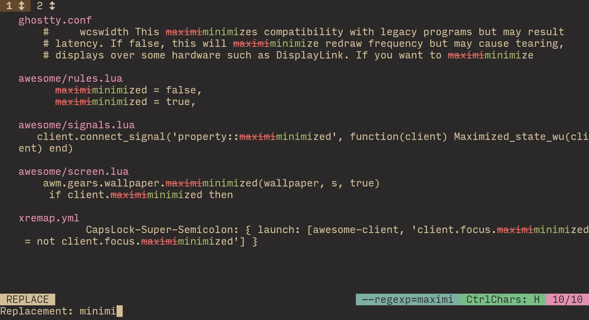

+++
title = 'best find & replace tool I found'
date = '2024-12-23'
+++

I used to do magic with the quickfix list back in neovim, that gave me a pretty good find & replace experience.

However as you may know, I switched to helix. It can be very barebones at times, compared to the shenanigans I wrote for myself in neovim. \
My find and replace now is mostly just the “find” part — I use helix's searcher, and then visit each place individually to modify it how I want. It's as laborious as it sounds.

"About time to change this" I decided, and went to look for an interactive find & replace tool.

First thing I found is [`serpl`](https://github.com/yassinebridi/serpl) \
It was quite precisely what I wanted! \
However, I quickly noticed [a bug](https://github.com/yassinebridi/serpl/issues/39) that literally disintegrated the UI over time. Non-0 chance I could fix it in my fork like I tend to do (apparently), but I'm not in love with the software enough to bother.

For what it's worth, it would be strange for a bug as big as this to exist for everyone. \
If you're interested in a TUI find & replace tool, serpl might still be for you! \
Maybe the stars align and the bug doesn't happen for you ✨

Conveniently though, serpl mentions another similar tool at the end of the readme. Honestly it's almost too nice, because it is just directly better for the most part! (if we exclude the bug I experienced)

The awkward name of this tool is [`repgrep`](https://github.com/acheronfail/repgrep). Nope, I didn't misspell [`ripgrep`](https://github.com/BurntSushi/ripgrep)!

Seems like the idea for the name is “ripgrep, but r***e***place”.

Similarly to ripgrep, the binary you will be using is not that wordy: `rgr`. Once again, the semantic of “rg, but ***r***eplace”.

The beauty of repgrep for me, is that it *just* uses ripgrep under the hood. \
Because of this, you won't need to learn any new arguments / flags to use repgrep — it *just* passes along the arguments to `rg`! \
So if you know `rg` flags, you automatically know `rgr` flags :D

You start repgrep by specifying the arguments to ripgrep, mainly the search pattern:

```fish
rgr maximi
```

And find yourself in the TUI:


It's as natural as it looks, so I won't spend time explaining all the hotkeys. You can look at them by pressing <kbd>?</kbd>.


Let's have a look at replace mode, that you get to by pressing <kbd>Enter</kbd> or <kbd>r</kbd>.



The interesting part of the design decisions, is that while entering your pattern, <kbd>Enter</kbd> doesn't confirm! \
Instead, it inserts a newline:


You accept by pressing the awkward hotkey <kbd>ctrl+s</kbd>.

Strange decision, but I respect the thinking behind it. Letting the user insert newlines just like that is pretty helpful, considering that neither `\n` nor `\r` work.

However still, accepting happens way more frequently than inserting a newline. Unfortunately, there is no configuration, so I couldn't change it in a normal way.

I maintain a helix fork already, what's one more? Especially not scary considering how long ago the most recent commit was. So, I forked repgrep to change the behavior of enter. \
Now <kbd>enter</kbd> accepts, <kbd>alt+enter</kbd> inserts a newline.

And that's how I finally have a nice find & replace tool!
