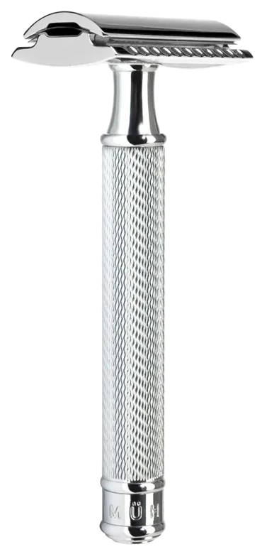
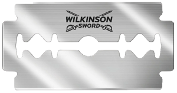

+++
title = 'safety razors slap'
date = '2024-12-30'
+++

Shaving is a massive hassle. Because I'm trans, it's even hassler for me than to the average person.

Elecric shavers are pretty low effort, but they also don't cut that close to the skin, so it's a good strategy to use when you have a lot of hair, but pretty ass if you don't.

To *get* a pretty ass though, you need the power of an actual razor.
But those have their own plethora of issues: they may cut you, "dribble" on the skin, introduce ingrown hairs, overall feel too rough and damage your skin. \
You can pick your razor to have more blades to mitigate some of these issues, but then the problem is the sheer price.

I'm broke as hell! I can't replace the blade as often as it's recommended, so I end up with a shitty razor for most of the time. If I go for a cheaper blade, I just *start* with a shitty one, lol.

Shaving sucks, doesn't it!

It's the thought that I accepted for the longest time. But just recently, my friend recommended me something that made me *want* to shave again. Over the past couple of days, I shaved my entire body. This barely ever happens! It's so fun now!

# safety razors

This product name sounded strangely vague to me!

A safety razor (image 1) is basically a holder for the classic razor blades (image 2). I had no clue what they were used for before!

So, a safety razor takes a razor blade, and bends it at the perfect angle to give you two bladed sides that you can use to shave with, making the razors *safe to use*. \
Interestingly, in russian, "razor blade" is sometimes literally called "dangerous razor".

I was warned that you need to be ***really*** careful when shaving with a safety razor — unlike your usual razor, you don't have the spinny bit that will follow the shape of the skin that you're shaving — you need to uphold that invariant yourself, otherwise you will get cut.

The friend that suggested a safety razor to me said she cut herself 6 times! Naturally I got anxious about that, and thought "nah I'd win and only get cut 2-3 times".

Eventually the safety razor arrived and I got to shaving. \
Turns out the name *wasn't* a lie! It *is* indeed safe!

Because of how sharp the razors are, I don't need to apply any pressure — I basically just let the handle dramatically fall against my skin... and it just works??
In the end I didn't get cut a single time, so I guess I *did* win!

The process of shaving is pretty similar to a normal razor, but you *do* need to be more careful and slow. \
Because it's just a single razor rather than 2-5, you can't just force the razor to do everything in one go — it is pretty important to first shave with the grain, and then against the grain.

Don't forget to apply shaving cream both times!

A normal razor has this colored line that somehow relaxes your skin after shaving across it; a safety razor doesn't have that.
And so you have to do the job of this colored line yourself by making sure you use shaving cream / gel more thoroughly.

Another tip which I've been using prior but not as conciously: warm up the area you plan to shave. Most straghtforward way is to apply some very warm water to the area.
This allegedly makes your hair softer, making it easier to shave off.

{{ hr(id="first-time") }}

So, I finish shaving with a safety razor for the first time, and wow! \
My skin feels FAR less damaged than it usually is with a normal razor. \
The experience itself is actually kinda... fun?
When was the last time shaving actually felt fun!

As I mentioned, over the last couple of days I went ahead and shaved my entire body. \
It's usually a massive chore, but for once I feel *excited* to shave, because my razor actually does its job as advertised! \
Nay, *better* than advertised!

And best of all, it is now *cheap*. REALLY fucking cheap. \
The replacement blade for my previous go-to razor cost me around 6$. \
More precisely, I could at minimum buy 2 at a time, costing me 12$.

I will remind you: I am very poor, and so I couldn't pay that price often enough to get the best performance out of the razor.

Now, for that same 6$, I can get a HUNDRED replacement razors. \
They are dirt cheap, **and** perform better than "peak" normal-razor-blades. \
Better shaves, less damaged skin, cheaper, more enjoyable.

Safety razors are amazing! Try one out if you haven't before!
