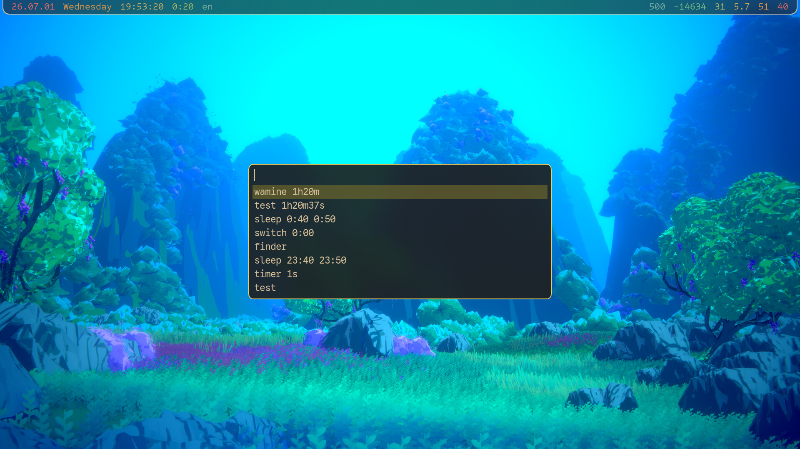
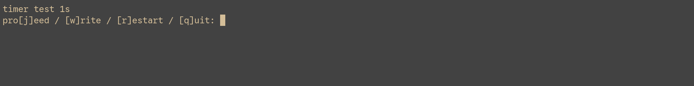
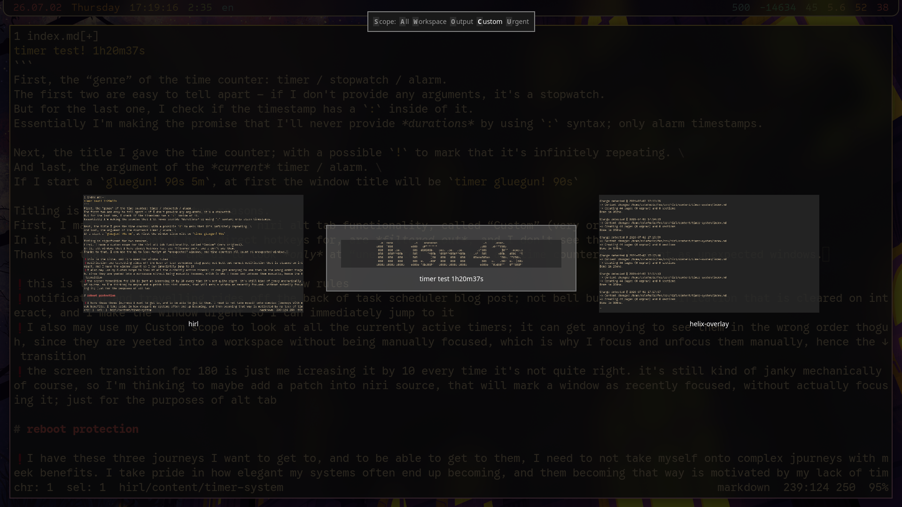
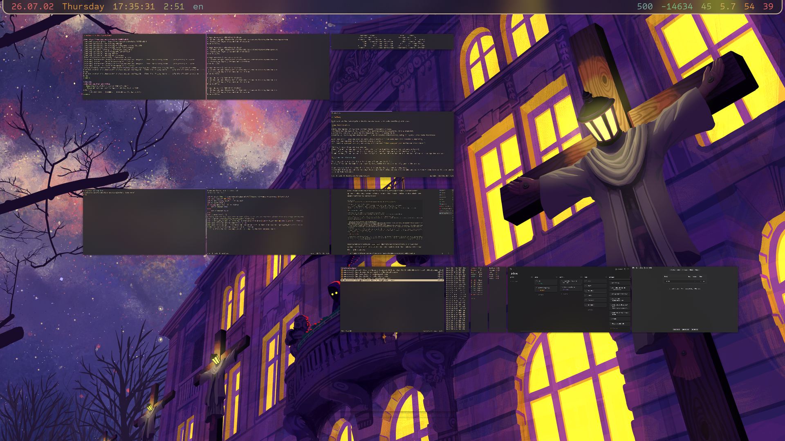
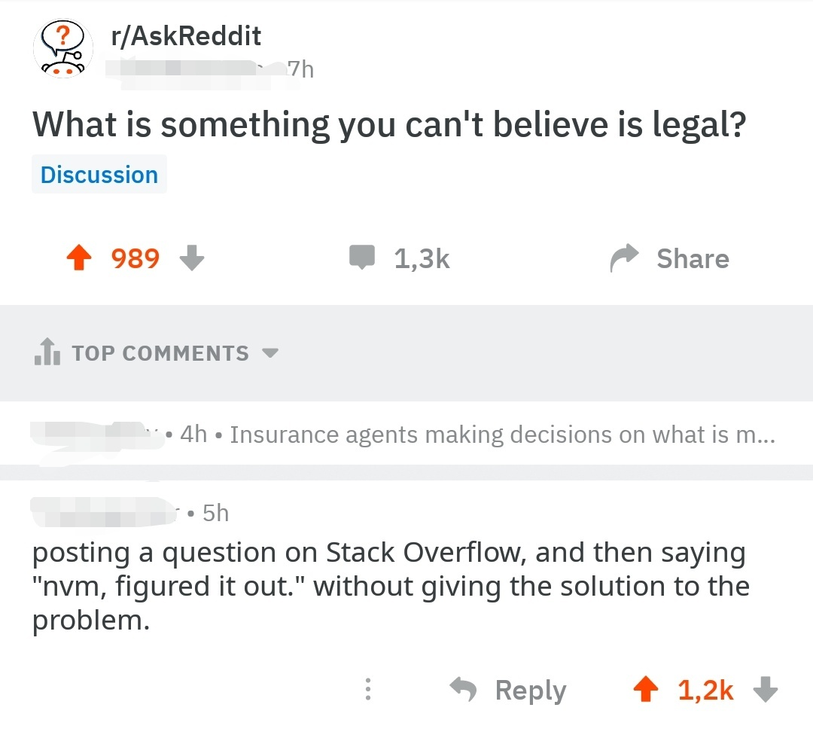

+++
title = 'timer system'
date = '2026-07-05'
+++

In [one of my recent blog posts](@/task-scheduler/index.md), it would be too overwhelming to show you the entire code at once, so I introduced all of the moving parts piece by piece, as I explained emerging usecases.
This worked pretty well, but was an annoying pain to actually write — jumping back and forth between what I'm showing you and what I *have* made things confusing. \
So this time, I think I'm just gonna blammo the two scripts in their entirety, and then spend the rest of the blog post explaining the usecases they solve, and the design decisions I needed to make.

A neat idea for you, the reader, would be duplicating this tab so that you can easily look back at the code when you realize something about it later down the line; but only barely skim it at first.

But well, it's not like the focus of my blog posts is to give you some specific, everything-included *implementation*.
I want to share with you the *idea* of a system I created, the journey of how I developed it, and hopefully motivate you to solve the usecase for yourself too.
You might choose a different system to do so; I'd've succeeded in my goal regardless — to make you consider it at all. \
The annoyance of you getting `confirm.rs` installed really underlines this. As well as a dependency on *two* shells and a compositor, lol.

```fish
function resolve_time_counter_genre -a timestamp
    if string match -qe ':' -- $timestamp
        echo alarm
    else if not test $timestamp
        echo stopwatch
    else
        echo timer
    end
end
funcsave resolve_time_counter_genre >/dev/null
```

`request-timer.fish`
```fish
#!/usr/bin/env fish

set -l input (tac ~/.local/share/magazine/c-t | fuzzel -d --match-mode exact 2>/dev/null)
not test "$input" && return 1
set -l the (string split ' ' -- $input)
set -l title $the[1]
if string match -qr '!$' -- $title
    set -f repeat true
else
    set -f repeat false
end
set -l rest $the[2..]
# doing some titling logic here so that window rules work as expected; window title may change afterwards
set -l genre (runner_timer_resolve_genre "$the[2]")
set -l prev_win_id (na -c "niri msg -j windows | from json | where is_focused == true | get id | first")
niri msg action do-screen-transition -d 180
niri msg action spawn -- foottitled.sh "$genre $title" -N timer.fish $repeat "$prev_win_id" $title $rest
indeed.rs -u ~/.local/share/magazine/c-t -- "$input"
tail -n 100 ~/.local/share/magazine/c-t | sponge ~/.local/share/magazine/c-t
```

`timer.fish`
```fish
#!/usr/bin/env fish

test "$argv[2]" && niri msg action focus-window --id $argv[2]
set -l name $argv[3]
if not test "$argv[4..]"
    set -l title "stopwatch $name"
    tit $title
    termdown -BW
    niri msg action focus-window-previous
    return
end
while true
    for time in $argv[4..]
        set -l genre (runner_timer_resolve_genre "$time")
        set -l title "$genre $name $time"
        while true
            tit $title
            notify-send "💣️ $title"
            set -l passed_time (
                if not string match -qe ':' -- $time
                    echo $time
                else
                    set -l current_hour (date +%H)
                    set -l current_minute (date +%M)
                    set -l the (string split ':' -- $time)
                    set -l passed_hour $the[1]
                    set -l passed_minute $the[2]
                    if test $current_hour -gt $passed_hour -o \( $current_hour -eq $passed_hour -a $current_minute -ge $passed_minute \)
                        echo "$(date -d 'today + 1 day' '+%Y-%m-%d') $time"
                    else
                        echo $time
                    end
                end
            )
            termdown -BW $passed_time
            # not using the foot-configured bell here because I *usually* don't want infinitely staying notifications on bell, but *can* afford them here thanks to custom fancy logic
            tit "⏰ $title"
            na -c "niri msg -j windows | from json | where app_id starts-with foot | where title == '⏰ $title' | get id | each { niri msg action set-window-urgent --id \$in } | ignore"
            notify-send -t 0 -- "⏰ $title"
            clear
            confirm.rs $title 'pro[j]eed' '[w]rite' '[r]estart' '[q]uit' | read -l input
            for notification_id in (fnottctl list | rg ": ⏰ $title" | string split ': ' | rg -v '^⏰')
                fnottctl dismiss $notification_id
            end
            niri msg action focus-window-previous &
            wait
            if test "$input" = q
                exit
            else if test "$input" = r
                continue
            else if test "$input" = w
                task $name
            end
            break
        end
    end
    if not $argv[1]
        break
    end
end
```

# begin

I actually quite like using physical tools.
There is of course my drilling special interest, but that's not even what I mean.
I like to write on paper, a **lot**. Very unfortunately, it's just too inefficient compared to my computer-based tooling. \
I'm excited by the idea of using a physical compass to help me navigate around the city (that I don't fully yet know).
I **love** analog clocks, and recently ordered a pocketwatch :3
I own *two* physical calculators, and absolutely adore them.

Following the theme, I used to heavily use a physical timer. I had it screwed into my table, so I could easily access it to start a timer, stopwatch, or even alarm! It is even pink! \
For example when I start cooking, I like to start a stopwatch to know when to *finish* cooking, and an indefinitely repeating timer for 3-5 minutes, so that I remember to come back and uhhhh... rotate the food every so often; rather than get lost in a task I'm doing at the computer and completely forget about the food.

This worked great, but had some limitations: there are only 2 “time counter” slots in the physical timer.
So once I start cooking, I take up two already, and can't start more.
If I decide to start the washine machine at the same time, I'll just have to rawdog remembering to take out the clothes on its finish.

I recently moved out, and I now share the apartment with someone I care about.
So the Time™ Counter™ is now in the kitchen, rather than at my table. \
I... don't have a way to start a timer conveniently anymore. And so I decided to create yet another system!

# the basics

A program called `termdown` does most of the heavy lifting for me.

The issue about using a basic `sleep`, is that if you ever decide to suspend your computer, you'll offset the end time by how much your computer spent asleep.
I set a `termdown` timer for a minute, and made my computer go to sleep.
Waited for quite a few seconds, and woke it up.
The time *did* go down! :D \
This is because instead of making time go *down*, `termdown` first figures out what the *end* time will be, and then shows you the difference between *now* and that end timestamp. So it's not stupid about suspends 😌

Ah and yes! It shows you the current time.
Either in normal text, or fancy ascii art text :D


You can configure whichever one you like; there are quite a few “fonts” to choose from. I picked `roman`

# time counter

What I need out of my Time™ Counter™ program, is to be able set timers, stopwatches, and alarms.
Time™ Counter™ is my made up term to umbrella the three together.

`termdown` can indeed do all of them! :D \
With no arguments provided, it starts a stopwatch.
If you give it a time, it'll start a timer for that time.
You can provide an *absolute* time like `12:00` to start an alarm for it.

Kind of annoyingly, if the `12:00` of today already passed, `termdown` will immediately exit.
Meaning that passing `01:00` at `23:00` won't do anything useful. \
I add custom logic that checks if the provided alarm time is in the past; and if it *is*, I explicitly specify **tomorrow**.

As for *timer* timestamps, I can do something like `1h20m37s` instead of `1h 20m 37s`, which helps a lot actually!
In something I'll explain later.

{{hr(id="starting")}}

Once I call `request-timer.fish`, I get myself an inputbox.
In my input, the first word is the *name* / title of the time counter, and the following values are timestamps to start timers / alarms for.



As you can see, I have *history* of all the time counters I've created; so once I make a particular one, I won't have to fully retype it in the future.

{{hr(id="timestamps")}}

I reiterate: timestamp***s***.

Something crucial about the timer system is that it allows me to create *one* window that will do multiple time counters in a row and then exit.

For example when using my glue gun, I set two timers: one for 90 seconds to wait for the glue gun to heat up, and then another timer for 5 minutes to wait for the glue I just set, to cool down. \
That's why the possibility of the `1h20m37s` syntax is so helpful: without it, I'd have to somehow inject spaces into the timestamp, before providing it to `termdown`; so that I could type in each as one argument within `request-timer.fish`.

{{hr(id="yes-point")}}

There would be no point in multiple timers if they *literally* executed one after the other.
Once a time counter finishes, I get notified; and a *prompt* is given to me:



I have to answer the prompt before the *next* timer starts; it **doesn't** start without my input.

So in the glue gun example, the first 90 seconds pass; I switch to the window of the just-finished timer, go pick up the glue gun, shoot all over the place, and come back to my computer.
I press <kbd>j</kbd> to pro**j**eed to the next timer; and now it's the 5 minute one I use to wait for the glue to cool down.

Just one glueing session isn't usually enough; so I can make my series of time counters infinitely *repeating*.
Rather than exiting after I respond to that 5 minute timer, I can make it go back to the 90 second one; and then it loops between the two.
So my *actual* time counter query for the glue gun is this:
```
gluegun! 90s 5m
```

Normally, the timer window quits after it finishes processing all its timers.
But if I add a `!` at the end of the title, it will repeat instead.

That's part of what the **q**uit response is for.
Within a series of timers, it will effectively skip all the following timers.
And within an *infinitely repeating* series of timers, it will close the entire window; stopping them all.

**R**estart repeats specifically the *current* timer.
Which can be helpful if you forgot to `!` or if you need one more of a particular timer within a series.

And finally **w**rite is just pro**j**eed, but will write the title of the timer into my waybar.
Helpful for things like the washing machine: I might not necessarily go handle it right *now*, but I need some sort of strong reminder to do it asap still.

# ergonomics

Most of the code in `timer.fish` is about updating the window title correctly, making the window urgent, and creating + closing the notification on a timer finish.
Ergonomics, essentially; since most of the *timer* logic is handled for me by termdown.

## titling

Each time counter window gets a helpful window title, that looks something like this:
```
timer test! 1h20m37s
```
First, the “genre” of the time counter: timer / stopwatch / alarm.
The first two are easy to tell apart — if I don't provide any arguments, it's a stopwatch.
But for the last one, I check if the timestamp has a `:` inside of it.
Essentially I'm making the promise that I'll never provide *durations* by using `:` syntax; only alarm timestamps.

Next, the title I gave the time counter; with a possible `!` to mark that it's infinitely repeating. \
And last, the argument of the *current* timer / alarm. \
If I start a `gluegun! 90s 5m`, the window title becomes `timer gluegun! 90s` during the first timer.

Titling is significant for two reasons.
First, I made a custom scope for the niri alt tab functionality, called “Custom” (very original).
In it, all windows that I have direct hotkeys for, are *filtered out*, and I don't see them.
Thanks to that, I can use the ui to look *only* at “unexpected” windows; and time counters all count as unexpected windows.



It is very clear what this timer *is* because I can see its title.
Neatly, I also get to look at the remaining time, without needing to actually jump to the window.

I calculate and set the title of the first time counter twice, somewhat annoyingly: the second reason titling is significant, is window rules.
The window that appears should *already* have some window title, so that I could make consistent window rules to move all time counters to my Task workspace.



Niftily, I can also window rule all time counters to have a lower *height*, to make them more recognizable both in the alt tab ui, and in the overview.

Once the window is created, its `timer test!` title that's used for the window rule, is immediately updated into `timer test! 1h20m37s`, on the timer actually *starting*.
In effect, I only ever see the latter title in my time counters.

## notifications and urgency

Once a time counter completes, it creates a notification, and makes that window urgent.
In my [task scheduler system](@/task-scheduler/index.md), I already make the bell character do that! Sooooo I might as well use it, right?

Small but annoying caveat.
What if I'm not paying attention to the computer when a timer finishes?
The notification that is sent might disappear by the time I see it, and so I'll effectively miss a timer going off.
Can't have that!

Wait, why do I even make bell notifications disappear anyway?
I feel like it's useful in the same exact way, to never miss some *terminal* finishing a command, no? \
Yes but no.
You see, with timers, I can make them close the notification for me, as soon as I interact with the confirm.rs prompt on finish.
Matter of fact I *want* the notification to stay until I interact with the prompt.
But in a normal terminal, there isn't really a clear “go away” signal so to speak.

Simplest one would be me pressing <kbd>Enter</kbd>.
When I press <kbd>Enter</kbd>, I could inject the logic of closing appropriate notifications, into my shell prompt.
But then... needlessly creating a new line just to close the notification feels yucky.

Fish lets you hook into FocusIn and FocusOut events though! :D
So I could clear notifications on every FocusIn?
*Yeah*, but foot doesn't send those events by default; you necessarily need to “enable” it on shell startup{{fn(i=1)}}.
And that isn't *exactly* free: if you run a `cat` with no arguments, then switch back and forth from that terminal, you'll see a bunch of `^[[I^[[O` printed.
In effect, you'll be seeing those characters every so often in otherwise completely normal program output, and it's kind of very annoying.

{{video(path="focus-events")}}

I don't know, I might still play with the focus idea in the future, but at the time it felt like a fool's errand.
For now, I just create the notifications, and make the window urgent *manually*.

My first approach wrt to urgency was to make all windows with the fitting window title become urgent.
In practice it would probably be totally fine, but I wasn't happy with the *possibility* that I could make multiple windows urgent at once, while only one of them needs the urgency.

Came up with something nifty for that: *right* after `termdown` finishes, I update the title to include a ⏰ at the start.
So now, even if I *for some reason* have more than one of the exact same time counter, only the one who just finished is targeted by the “make window urgent” logic.
This ends up having an unexpected extra benefit: if I, god forbid, focus the finished window but *don't* interact with it and move away, it will no longer be urgent.
But it *will* still have a ⏰ in its window title!
So it will be clear at least in the Custom scope.

*Notification* logic is less precise.
The *finished window* creates its notification, but after interacting with confirm.rs, *all matching* notifications are closed.
So if two of the same (again, how did I get into such a position) time counters finish at the same-ish time, interacting with one will close both notifications.
But the *urgency* of the other, uninteracted time counter still stays, and I *will* notice that I closed two notifications while intending to close only one, so I'll just handle it on the spot.
Not the cleanest situation, but I don't think it'll ever happen anyway.

# order

When you create a new window, it is focused. Usually. \
There is some dbus... or was it xdg? magic that windows do on starting up, where they ask the compositor to focus them. Something like that.

Well anyway, if you create a window using `footclient` and window rule it to appear on a different workspace, it **won't** get activated.
That's fantastic! Because I get to create timers without being jumped into a vomit.
But since the window was never focused, only created, how *recent* it is in alt tab is wrong.

I create a timer for the washing machine, and another for cooking. \
I *just* created the cooking timer, so I expect to get to it with a single alt tab press.
But it's not even close. Both timers appear *after* all the windows that *were* focused at least once; so I need to tab alt tab possibly quite a few times before I get to either of the timers. \
But then to top it off, the cooking timer shows up *after* the washing machine timer, despite being more recent(ly created)!

Soooo to increase ergonomics, I *do* need to focus the just-created timer after all.
When you `niri msg spawn -- footclient`, the window which is created *is* focused.
And then at the start of the `timer.fish` script, I focus the window I was just at, before the timer.

`niri msg action focus-window-previous` exists, but it uses alt tab debounce semantics, so to avoid shooting myself in the foot, I explicitly store the id of the just-at window, and pass it into the timer; so that it can activate *that one* (even if I stayed at that window for less than a second).

All this is not... great? Because now I rapidly see two animations on creating a timer, so I blammoed a hacky `niri msg action do-screen-transition -d 190` to essentially freeze the screen while the animations are happening. \
I'm thinking of a few things I could do to avoid neededing to do that though. All would need to happen in the niri source for the record; but I already fork niri so that's not an issue.

My first thought was to create a custom action that marks a window as focused, but without actually focusing it. Mark it as focused for the purposes of alt tab, essentially.
Second idea is to duplicate the `focus-window` action (or maybe add a flag), but make it not play the animation. Thanks to that, I'd be able to do the two focuses instantly.
That should be easier to implement as well, but I'm not sure how I would target the just-created window. I feel like I would need to add the flag to `niri msg action spawn` as well.

Check out my [niri fork](https://github.com/Axlefublr/niri), maybe by the point you're reading this blog post, I've already solved this problem somehow.

# natural usage

I create a timer, and I'm not moved anywhere (effectively); I stay at the window I was at. I am not disturbed.
Once the timer finishes, I get a notification that won't go away on its own.
The relevant timer window is marked as urgent, so I press my Urgent scope alt tab hotkey to jump to it immediately.
I decide what to do, and press the desired key to respond to the confirm.rs.
When I do so, I am *automatically* jumped to the most recent window that I just jumped *from*.

Holding timers in windows had a big opportunity to be extremely flow-breaking, but thankfully I managed to avoid that! :D

# reboot protection

If I logout, reboot, or poweroff, I lose all my timers.
Fixing this *properly* would require the system to become... a *lot* more complicated, I figure.

I don't have the time for all that! I've been trying to get back to learning crystal FOR A YEAR now, and I keep getting sidetracked by new journeys :p \
So I do something much simpler.

`reboot` and `poweroff` become *aliases*, into which I put preventative logic.
```fish
function allow_logout
    not test -e ~/fes/zufi/tms/receiver-ongoing
    or begin
        torn 'refusing: ongoing receiver tasks'
        return
    end
    na -c 'niri msg -j windows | from json | where app_id starts-with foot | where title =~ "^(⏰ )?(timer|stopwatch|alarm)" | if ($in | is-not-empty) { exit 1 }'
    or begin
        torn 'refusing: ongoing time counters'
        return
    end
    na -c 'niri msg -j windows | from json | where is_urgent == true | if ($in | is-not-empty) { exit 1 }'
    or begin
        torn 'refusing: urgent windows present'
        return
    end
end

function torn
    if status is-interactive
        warn $argv
    else
        notify-send -- $argv
    end
    return 1
end
```

Both `reboot` and `poweroff` are on *hotkeys* for me.
So now when I try to reboot, three things are checked:
1. are there ongoing [task scheduler](@/task-scheduler/index.md) tasks?
2. are there ongoing **timers**?
3. are there any urgent windows?

If one of those is true, the reboot / poweroff is rejected, and just doesn't happen.
And of course, I get a notification telling me why it didn't happen.

It just saved me today actually: I was recompiling niri after fixing a bug in one of my patches, so I wrote a `while true` loop{{fn(i=2)}} in a shell to effectively reboot as soon as the compilation was done.
I noticed that despite the compilation finishing, I still wasn't rebooted! \
I look at the output and see “refusing: ongoing time counters”...
What time counters?? → Ohhhhh the washing machine, right!

Without this safety fence, I would probably have forgotten about the washing machine altogether.

# footnotes

{{hn(i=1)}} You would rightfully kill me if I never actually told you how.



```fish
printf '\x1b[?1004h'
```
To enable focus event reporting for the session,
```fish
printf '\x1b[?1004l'
```
to disable it.
See `man foot-ctlseqs` for more details.

{{hn(i=2)}} Why I didn't just schedule `suspend` right after scheduling the niri compilation, is an exercise to the reader.
I believe there is sufficient information in this blog post, to figure out the reason. If not, read the [task scheduler](@/task-scheduler/index.md) blog post as a hint.
