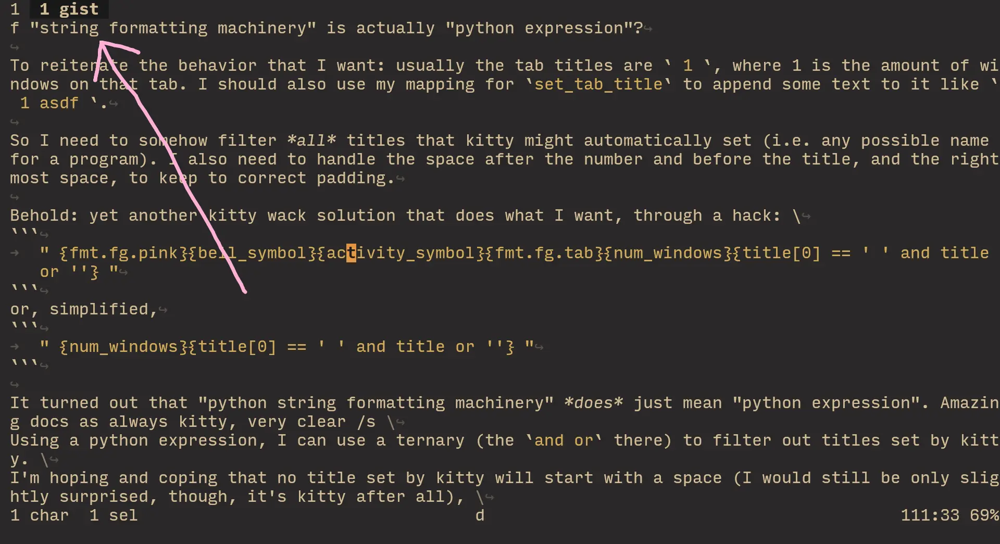

I say "god I hate kitty" a lot, but I usually can't think of examples for *why* on the spot. \
I just encountered yet another "god I hate" about kitty, so I'm gonna write it down while it's hot to transfer why I hate this terminal emulator so much.

# an innocent desire

I wanted a certain feature: in the tab bar, usually I want tabs to just have their number displayed, and nothing else. But optionally, I should be able to add a title to an individual tab.

You might reasonably think "oh that sure sounds like a job for a plugin" and in any other app, something this specific would require a plugin, yes. Kitty, however, picks to be between a rock and a hard place.

Usually when configuring things, ideas come to mind because I already have a very vague idea of how to do it / assume it's doable. \
It was the case here too: there's an option called `tab_title_template` that lets you define the text displayed in each individual tab in the tab bar. Aside from feeling a bit wonky ([have a look](https://sw.kovidgoyal.net/kitty/conf/index.html#opt-kitty.tab_title_template)), I actually quite like it because it's pretty flexible for a config-based terminal emulator (rather than one that uses a programming language directly, like wezterm).

So I put in the title there and went on to configure.

A lot of terminal applications change the shell title (or window title you would usually call it?), so once I configured them to not, I was able to get to `fish_title`.

`fish_title` is fish shell's mechanism for setting the shell title, and it's really cool!
You can use arbitrary fish shell logic to print the exact title that you want. \
I used to use it a long time ago, but found the concept of changing shell title more distracting than useful, so I removed it.

I came back to it now to try to make it more useful: usually the title would be some reasonable default I define in `fish_title`, but I could also override it to be something else instead. I used an arbitrary variable called `title` that I could set to do that overriding, all in my shell.

That sounds like a finished job, doesn't it? But here comes in kitty, trying to be useful in the most annoying way.

`fish_title` runs before and after making your shell prompt, and there *can* be times where fish doesn't report its title, or sets it to a blank string, before setting it again.

In actual usage what ended up happening, is sometimes my kitty tab title changed to `fish` for a flash, and then got back to the title defined in `fish_title`. \
So I thought "huh, maybe fish is reporting some `fish -c` action and so is setting the title to that?" — my logic for making the title was pretty solid, but I assumed it allowed something like that to happen. \
My solution for this was to stop trying to make the title useful, and disable it completely. I set `fish_title` to be a blank function the echoes nothing.

Imagine my horror when after doing so, I still see `fish`. \
??? wtf the title is supposed to be blank now? \
And *now* I realize that fish was doing its work perfectly fine, and there was no issue there to begin with — it was *kitty*'s default messing things up.

So *turns out* (I don't think it's documented, at least I wasn't able to come across this in the documentation) in kitty, if your shell hasn't got the shell title set, it will default to whatever the current app running is. \
That `fish` was kitty saying "hey! you're running fish!" because I was just looking at my shell.

I have some kitty mappings that open programs directly in overlay windows (which are REALLY cool btw), and once I opened `yazi` like that, I saw `yazi` in the window title.

Eureka! 🥳

You know what this means now? The fish shell titling mechanism is effectively useless, because kitty will interrupt and set a default intermittently with fish, so the tab title will jump jarringly and is therefore not worth using.

I set the `shell_integration` kitty option to `no-title`. While we disabled `fish_title`, some programs can still set the shell title themselves, and that option ensures that it's ignored. Now only kitty has the capability to set its own tab titles.

Now practically every tab has `fish` in its title, that sometimes turns into `yazi` / `lazygit`. The latter is kinda cool, but having `fish` in every title is pretty jarringly useless.

The other piece of the puzzle, `set_tab_title`, is a kitty action you can map to, that will let you interactively change the tab title. \
With it, I have a solution: I could rename every tab I use to make more sense, rather than being just `fish`. \
But also, that's pretty unreasonable to ask of myself — I create and close tabs all the time, very quickly, and in reality I'll just end up seeing a lot of 🐟es in my tab titles, and *sometimes* see my *actual* titles. \
All that plus I'll feel more pressured to title tabs that I don't actually care to have titles.

Between a rock and a hard place.

A VERY obvious solution that you might've just thought about is to just disable this default kitty functionality that sets the titles to begin with. Very reasonable! I thought about it too, but you can't disable it, as far as I'm aware 💀

You might now think "well surely that's a bug! you should open an issue about this" which is once again reasonable, but I already got burned on that with kitty.

Kitty is infamous, first and foremost, for its unbearable dev. He instantly closes issues (which in itself is not an issue (lol)), rudely disregarding often times *reasonable* concerns.

My story: \
You can set the shape of the cursor in kitty with the `cursor_shape` option. It can be one of `block`, `beam`, `underline`. \
There is also a `cursor_shape_unfocused` option. Does the same thing, but for when kitty is not in focus. *Except*, it can *also* be `hollow`.

Yes, you cannot set `cursor_shape` to `hollow`, but can set it for `cursor_shape_unfocused`!

That seemed like an obvious misstep but I've been taught by others that sometimes even "obvious" things should be reported in issues and worked on in PRs, so I created a PR adding `hollow` to `cursor_shape`.

...Instantly rejected with something along the lines of "this is stupid, the `hollow` shape shows that kitty is unfocused". \
This is awful on multiple levels.

Sure, `cursor_shape` being `hollow` by default would be stupid, but there *should* be an option to set it, because it's up to the *USER* to decide that for themselves. You **never** fully know the usecase of each user, and should allow them to be "stupid" if that's what they actually want. \
The argument also doesn't hold up because you can set set both `cursor_shape` and `cursor_shape_unfocused` to block and continue to "not know if kitty is focused or not", so why should you be unable to set them both to `hollow`??

If your window manager and kitty window borders already make things clear, it's not unreasonable to not care about the cursor shape, especially considering that the hollow cursor looks really cool! \
I would 30% understand if I opened an *issue*, but I opened a *PR* that just adds that, so all you have to do is press accept and blammo! The change is literally two lines, one of which is the docs, so even the maintenance argument doesn't hold weight here.

This same exact feature request I opened as an *issue* in ghostty, the dev said "huh I don't see why not" and implemented it a couple of days later. Night and day.

If this was my *only* interaction with the kitty dev, I would give him the benefit of the doubt (although would still be annoyed), but all I hear about the kitty dev from people is mostly stories like mine.

Coming back to shell titles: this is why it's not worth the effort to open an issue to make the default kitty titling behavior disableable.

I could potentially change it in source code and compile my own kitty, but I have no clue how to compile kitty — it feels like a big mishmash of everything that I really wouldn't want to work with, even though I *do* keep a [helix fork](https://github.com/Axlefublr/helix).

Next I came across [session files](https://sw.kovidgoyal.net/kitty/overview/#sessions). "Surely the bee's knees" I thought — they allow you to specify a bunch of kitty commands to execute on startup. Buuuut on startup of the *instance*, so they won't control each individual window / tab, which is what I would need. Even calling `set_tab_title` in the session file didn't do anything for even the first window (which I don't exactly get).

The final possibility is "watchers". Python scripts that listen on kitty events and execute kitty code on them. That's what I'm guessing they are anyway, because I dismissed them instantly out of this thought process: \
Oppositely from session files, the watcher would run on... when exactly? Let's say I'm lucky and there's a "title changed" event. \
Will that event run on *startup*? This is only based on my overall experience using kitty, but I assumed it would for some reason *not*, specialcasing when you first launch kitty, and working normally all the following windows. \
I have no reason to think this except kitty being similarly horrible to me like 20 other times, so this isn't really a "point". \
For all I know, watchers might be the bee's knees but at this point I was tired and making a python script to work around yet another "nice" kitty behavior didn't seem worth it.

So I give up. I get hyperfocused on things like this often and that can put me in a spiral. I went and did some house chores, until I got another idea...

In `tab_title_template`, this is offhandedly mentioned:

> Note that formatting is done by Python’s string formatting machinery

I mostly diregarded this because what in the living and dying hell is "string formatting machinery".
The limits of how it actually works are not well defined in the docs, so that's why I went on to try other options that *felt* viable, before coming to this one.

In the docs, we get this example: `{layout_name[:2].upper()}` \
I realize that I can at least slice strings and call methods on them. \
This by itself is not strong enough for what I'm trying to do, so I decided to take a gamble: what if "string formatting machinery" is actually "python expression"?

To reiterate the behavior that I want: usually the tab titles are ` 1 `, where 1 is the amount of windows on that tab. I should also use my mapping for `set_tab_title` to append some text to it like ` 1 asdf `.

So I need to somehow filter *all* titles that kitty might automatically set (i.e. any possible name for a program). I also need to handle the space after the number and before the title, and the rightmost space, to keep to correct padding.

Behold: yet another kitty wack solution that does what I want, through a hack: \
```
" {fmt.fg.pink}{bell_symbol}{activity_symbol}{fmt.fg.tab}{num_windows}{title[0] == ' ' and title or ''} "
```
or, simplified,
```
" {num_windows}{title[0] == ' ' and title or ''} "
```

It turned out that "python string formatting machinery" *does* just mean "python expression". Amazing docs as always kitty, very clear /s \
Using a python expression, I can use a ternary (the `and or` there) to filter out titles set by kitty. \
I'm hoping and coping that no title set by kitty will start with a space (I would still be only slightly surprised, though, it's kitty after all), \
and because I need a space between the number and the title, \
if I always start my tab titles with a space, I get to solve two issues in one approach!



1. Press my `set_tab_title` hotkey
2. Type in ` gist`
3. Bob becomes the brother of your parent

So while I have my desired behavior, I'm obviously unhappy about it. It's a hack as clear as day.

The real issue with kitty that makes me so mad at it, is that it shines gold coins at you all over the place, suggesting that making some feature you assume is obvious is going to be easy. \
It shows you multiple different approaches through its functionality, and so you think "with so many options, surely this is trivial".

And yet, time and time again, I come across poorly worded / explained documentation, strange "useful" default behavior I have to work around, a very unhelpful dev that I can simply ignore trying to contact for better behavior, a messy project structure where it's not viable (at least for me) to keep a personal fork, a billion features, all of which are somehow *just* not enough for the functionality I want, but enough to make me excited to try implementing it, and an autistic brain that makes me want to configure my tools in ways that *apparently* no one else has wanted. Somehow.

Sounds awful, doesn't it? \
If you were as into configuring your terminal, I'm sure you would hate kitty too.

All of these are reasons for why I use kitty but can't recommend it. I *can* easily recommend alacritty, though.

Alacritty can't do shit but doesn't claim it can, so you have to just deal with it. Helix can't do shit and doesn't claim you can, so you have to just deal with it (you can draw the same connection between neovim and helix as I am drawing with kitty and alacritty). 

I hope that draws a clear enough picture for my hatred towards this feline terminal emulator. I gave two examples here but you should subconsciously multiply them by at least 7. This is not my first or last kitty configuring adventure that goes in me hating it more, this is just the first time I caught it and decided to write it down.

The worst part about all of this is that I now have yet another cool and useful feature that is either hard or impossible to recreate in another terminal emulator, so I'm bound to use a terminal I despise.

Kitty has better looking and faster rendering than anything else (except *maybe* ghostty, although ime ghostty was slower, and I was *trying* to like ghostty so I doubt it was bias). \
It slightly boldens fonts which is REALLY weird for it to do but now I really love it and can't live without. \
It doesn't make ANY gui-like elements, which I hate especially in terminals: even the tab bar looks like it's from a tui application. \
The remote window manipulation is super powerful, and I make a lot of use from windows, tabs, layouts, overlays (omg the overlays 😩) (yet another painful config adventure). \
Kitty can work as a "server" for kitty, letting you create new os windows practically instantly (ghostty can do this too but in a different way and slower) (this adventure was especially painful). \
The binding system is really powerful and lets me use chord mappings.

The supposed "new best terminal" ghostty has some of these features, but they often times are not as good, or just equal; some things are missing or work worse so I don't feel encouraged to switch off kitty, and I am...

> between a rock and a hard place
